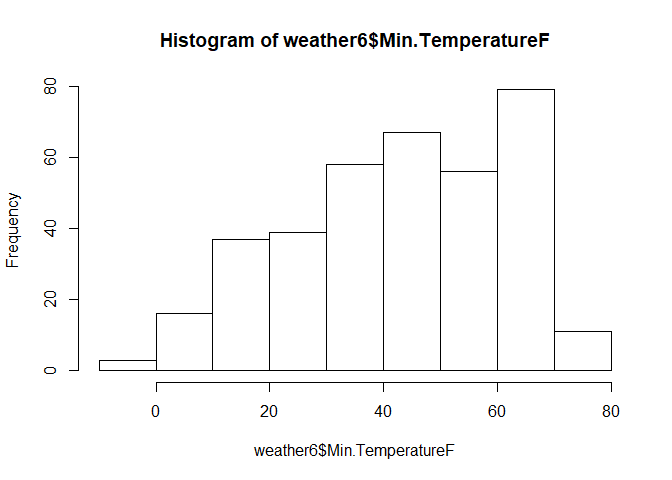

Cleaning Data With R
================
Paul G. Smith
10/31/2019

  - [Cleaning Data With R](#cleaning-data-with-r)
      - [Overview](#overview)
      - [Exploring raw data](#exploring-raw-data)
          - [What messy data looks like](#what-messy-data-looks-like)
          - [What clean data looks like](#what-clean-data-looks-like)
          - [Exploring raw data](#exploring-raw-data-1)
          - [Looking at the data](#looking-at-the-data)
          - [Understanding the structure of the
            data](#understanding-the-structure-of-the-data)
          - [Look at the data](#look-at-the-data)
          - [Visualizing the data](#visualizing-the-data)
      - [Tidying data](#tidying-data)
          - [Introduction to tidy data](#introduction-to-tidy-data)
          - [Introduction to tidyr](#introduction-to-tidyr)
          - [Gathering columns into
            key-value-pairs](#gathering-columns-into-key-value-pairs)
          - [Spreading key-value pairs](#spreading-key-value-pairs)
          - [Separating columns](#separating-columns)
          - [Uniting columns](#uniting-columns)
          - [Addressing common symptoms of messy
            data](#addressing-common-symptoms-of-messy-data)
          - [Column headers are values, not variable
            names](#column-headers-are-values-not-variable-names)
      - [Preparing data for analysis](#preparing-data-for-analysis)
          - [Type conversions](#type-conversions)
          - [Types of variables in R](#types-of-variables-in-r)
          - [Common type conversions](#common-type-conversions)
          - [Working with dates](#working-with-dates)
          - [Trimming and padding
            strings](#trimming-and-padding-strings)
          - [Upper and lower case](#upper-and-lower-case)
          - [Finding and replacing
            strings](#finding-and-replacing-strings)
          - [Missing and special values](#missing-and-special-values)
          - [Finding missing values](#finding-missing-values)
          - [Dealing with missing values](#dealing-with-missing-values)
          - [Outliers and obvious errors](#outliers-and-obvious-errors)
          - [Dealing with outliers and obvious
            errors](#dealing-with-outliers-and-obvious-errors)
          - [Another look at strange
            values](#another-look-at-strange-values)
      - [Putting it all together](#putting-it-all-together)
          - [Get a feel for the data](#get-a-feel-for-the-data)
          - [Summarize the data](#summarize-the-data)
          - [Take a closer look](#take-a-closer-look)
          - [Column names are values too](#column-names-are-values-too)
          - [Values are variable names](#values-are-variable-names)
          - [Clean up dates](#clean-up-dates)
          - [A closer look at column
            types](#a-closer-look-at-column-types)
          - [Column type conversions](#column-type-conversions)
          - [Find missing values](#find-missing-values)
          - [An obvious error](#an-obvious-error)
          - [Another obvious error](#another-obvious-error)
          - [Check other extreme values](#check-other-extreme-values)
          - [Finishing touches](#finishing-touches)
          - [Now your data are clean\!](#now-your-data-are-clean)

# Cleaning Data With R

## Overview

The purpose of this project is to highlight issues related to cleaning
data, and demonstrating many common strategies and techniques using R
programming to clean and prep the data for analysis.

## Exploring raw data

Essential R commands:

  - class, dim, names, str, glimpse, summary
  - head, tail, print
  - hist, plot
  - gather -\> combines multiple columns into two rows with key and
    value (tidyr)
  - spread -\> moves key value columns to multiple columns with keys as
    column names (tidyr)
  - separate - \> splits a column by \_ or whatever seperator you choose
    to multiple columns (tidyr)
  - unite -\> combines multiple columns to one column with \_ as the
    seperator (tidyr)
  - as.character
  - as.numeric
  - as.integer
  - as.factor
  - as.logical
  - ymd - (lubridate)
  - mdy - (lubridate)
  - hms - (lubridate)
  - ymd\_hms - (lubridate)

### What messy data looks like

  - X column is just the row number
  - days are spread but should be part of the date field and have one
    row per date
  - year and month and day should be one data column
  - measures are melted but should be each in a column
  - and so on…

<!-- end list -->

``` r
# load and prep sample tables
weather <- readRDS('data/weather.rds')

# first look at a messy data set
# look at the first 6 rows
head(weather)
```

    ##   X year month           measure X1 X2 X3 X4 X5 X6 X7 X8 X9 X10 X11 X12
    ## 1 1 2014    12  Max.TemperatureF 64 42 51 43 42 45 38 29 49  48  39  39
    ## 2 2 2014    12 Mean.TemperatureF 52 38 44 37 34 42 30 24 39  43  36  35
    ## 3 3 2014    12  Min.TemperatureF 39 33 37 30 26 38 21 18 29  38  32  31
    ## 4 4 2014    12    Max.Dew.PointF 46 40 49 24 37 45 36 28 49  45  37  28
    ## 5 5 2014    12    MeanDew.PointF 40 27 42 21 25 40 20 16 41  39  31  27
    ## 6 6 2014    12     Min.DewpointF 26 17 24 13 12 36 -3  3 28  37  27  25
    ##   X13 X14 X15 X16 X17 X18 X19 X20 X21 X22 X23 X24 X25 X26 X27 X28 X29 X30
    ## 1  42  45  42  44  49  44  37  36  36  44  47  46  59  50  52  52  41  30
    ## 2  37  39  37  40  45  40  33  32  33  39  45  44  52  44  45  46  36  26
    ## 3  32  33  32  35  41  36  29  27  30  33  42  41  44  37  38  40  30  22
    ## 4  28  29  33  42  46  34  25  30  30  39  45  46  58  31  34  42  26  10
    ## 5  26  27  29  36  41  30  22  24  27  34  42  44  43  29  31  35  20   4
    ## 6  24  25  27  30  32  26  20  20  25  25  37  41  29  28  29  27  10  -6
    ##   X31
    ## 1  30
    ## 2  25
    ## 3  20
    ## 4   8
    ## 5   5
    ## 6   1

``` r
# look at the last 6 rows
tail(weather)  
```

    ##       X year month            measure   X1   X2   X3   X4   X5   X6   X7
    ## 281 281 2015    12 Mean.Wind.SpeedMPH    6 <NA> <NA> <NA> <NA> <NA> <NA>
    ## 282 282 2015    12  Max.Gust.SpeedMPH   17 <NA> <NA> <NA> <NA> <NA> <NA>
    ## 283 283 2015    12    PrecipitationIn 0.14 <NA> <NA> <NA> <NA> <NA> <NA>
    ## 284 284 2015    12         CloudCover    7 <NA> <NA> <NA> <NA> <NA> <NA>
    ## 285 285 2015    12             Events Rain <NA> <NA> <NA> <NA> <NA> <NA>
    ## 286 286 2015    12     WindDirDegrees  109 <NA> <NA> <NA> <NA> <NA> <NA>
    ##       X8   X9  X10  X11  X12  X13  X14  X15  X16  X17  X18  X19  X20  X21
    ## 281 <NA> <NA> <NA> <NA> <NA> <NA> <NA> <NA> <NA> <NA> <NA> <NA> <NA> <NA>
    ## 282 <NA> <NA> <NA> <NA> <NA> <NA> <NA> <NA> <NA> <NA> <NA> <NA> <NA> <NA>
    ## 283 <NA> <NA> <NA> <NA> <NA> <NA> <NA> <NA> <NA> <NA> <NA> <NA> <NA> <NA>
    ## 284 <NA> <NA> <NA> <NA> <NA> <NA> <NA> <NA> <NA> <NA> <NA> <NA> <NA> <NA>
    ## 285 <NA> <NA> <NA> <NA> <NA> <NA> <NA> <NA> <NA> <NA> <NA> <NA> <NA> <NA>
    ## 286 <NA> <NA> <NA> <NA> <NA> <NA> <NA> <NA> <NA> <NA> <NA> <NA> <NA> <NA>
    ##      X22  X23  X24  X25  X26  X27  X28  X29  X30  X31
    ## 281 <NA> <NA> <NA> <NA> <NA> <NA> <NA> <NA> <NA> <NA>
    ## 282 <NA> <NA> <NA> <NA> <NA> <NA> <NA> <NA> <NA> <NA>
    ## 283 <NA> <NA> <NA> <NA> <NA> <NA> <NA> <NA> <NA> <NA>
    ## 284 <NA> <NA> <NA> <NA> <NA> <NA> <NA> <NA> <NA> <NA>
    ## 285 <NA> <NA> <NA> <NA> <NA> <NA> <NA> <NA> <NA> <NA>
    ## 286 <NA> <NA> <NA> <NA> <NA> <NA> <NA> <NA> <NA> <NA>

``` r
# look at a summary of the data
str(weather)
```

    ## 'data.frame':    286 obs. of  35 variables:
    ##  $ X      : int  1 2 3 4 5 6 7 8 9 10 ...
    ##  $ year   : int  2014 2014 2014 2014 2014 2014 2014 2014 2014 2014 ...
    ##  $ month  : int  12 12 12 12 12 12 12 12 12 12 ...
    ##  $ measure: chr  "Max.TemperatureF" "Mean.TemperatureF" "Min.TemperatureF" "Max.Dew.PointF" ...
    ##  $ X1     : chr  "64" "52" "39" "46" ...
    ##  $ X2     : chr  "42" "38" "33" "40" ...
    ##  $ X3     : chr  "51" "44" "37" "49" ...
    ##  $ X4     : chr  "43" "37" "30" "24" ...
    ##  $ X5     : chr  "42" "34" "26" "37" ...
    ##  $ X6     : chr  "45" "42" "38" "45" ...
    ##  $ X7     : chr  "38" "30" "21" "36" ...
    ##  $ X8     : chr  "29" "24" "18" "28" ...
    ##  $ X9     : chr  "49" "39" "29" "49" ...
    ##  $ X10    : chr  "48" "43" "38" "45" ...
    ##  $ X11    : chr  "39" "36" "32" "37" ...
    ##  $ X12    : chr  "39" "35" "31" "28" ...
    ##  $ X13    : chr  "42" "37" "32" "28" ...
    ##  $ X14    : chr  "45" "39" "33" "29" ...
    ##  $ X15    : chr  "42" "37" "32" "33" ...
    ##  $ X16    : chr  "44" "40" "35" "42" ...
    ##  $ X17    : chr  "49" "45" "41" "46" ...
    ##  $ X18    : chr  "44" "40" "36" "34" ...
    ##  $ X19    : chr  "37" "33" "29" "25" ...
    ##  $ X20    : chr  "36" "32" "27" "30" ...
    ##  $ X21    : chr  "36" "33" "30" "30" ...
    ##  $ X22    : chr  "44" "39" "33" "39" ...
    ##  $ X23    : chr  "47" "45" "42" "45" ...
    ##  $ X24    : chr  "46" "44" "41" "46" ...
    ##  $ X25    : chr  "59" "52" "44" "58" ...
    ##  $ X26    : chr  "50" "44" "37" "31" ...
    ##  $ X27    : chr  "52" "45" "38" "34" ...
    ##  $ X28    : chr  "52" "46" "40" "42" ...
    ##  $ X29    : chr  "41" "36" "30" "26" ...
    ##  $ X30    : chr  "30" "26" "22" "10" ...
    ##  $ X31    : chr  "30" "25" "20" "8" ...

### What clean data looks like

  - Each row is a daily record of the weather
  - There is a lot cleaned up here
  - We will clean this data set in the last section

<!-- end list -->

``` r
# load and prep sample table
weather_clean <- readRDS('data/weather_clean.rds')

# look at the first 6 rows
head(weather_clean)
```

    ##         date    events cloud_cover max_dew_point_f max_gust_speed_mph
    ## 1 2014-12-01      Rain           6              46                 29
    ## 2 2014-12-02 Rain-Snow           7              40                 29
    ## 3 2014-12-03      Rain           8              49                 38
    ## 4 2014-12-04      None           3              24                 33
    ## 5 2014-12-05      Rain           5              37                 26
    ## 6 2014-12-06      Rain           8              45                 25
    ##   max_humidity max_sea_level_pressure_in max_temperature_f
    ## 1           74                     30.45                64
    ## 2           92                     30.71                42
    ## 3          100                     30.40                51
    ## 4           69                     30.56                43
    ## 5           85                     30.68                42
    ## 6          100                     30.42                45
    ##   max_visibility_miles max_wind_speed_mph mean_humidity
    ## 1                   10                 22            63
    ## 2                   10                 24            72
    ## 3                   10                 29            79
    ## 4                   10                 25            54
    ## 5                   10                 22            66
    ## 6                   10                 22            93
    ##   mean_sea_level_pressure_in mean_temperature_f mean_visibility_miles
    ## 1                      30.13                 52                    10
    ## 2                      30.59                 38                     8
    ## 3                      30.07                 44                     5
    ## 4                      30.33                 37                    10
    ## 5                      30.59                 34                    10
    ## 6                      30.24                 42                     4
    ##   mean_wind_speed_mph mean_dew_point_f min_dew_point_f min_humidity
    ## 1                  13               40              26           52
    ## 2                  15               27              17           51
    ## 3                  12               42              24           57
    ## 4                  12               21              13           39
    ## 5                  10               25              12           47
    ## 6                   8               40              36           85
    ##   min_sea_level_pressure_in min_temperature_f min_visibility_miles
    ## 1                     30.01                39                   10
    ## 2                     30.40                33                    2
    ## 3                     29.87                37                    1
    ## 4                     30.09                30                   10
    ## 5                     30.45                26                    5
    ## 6                     30.16                38                    0
    ##   precipitation_in wind_dir_degrees
    ## 1             0.01              268
    ## 2             0.10               62
    ## 3             0.44              254
    ## 4             0.00              292
    ## 5             0.11               61
    ## 6             1.09              313

``` r
# look at the last 6 rows
tail(weather_clean)  
```

    ##           date events cloud_cover max_dew_point_f max_gust_speed_mph
    ## 361 2015-11-26   None           6              49                 28
    ## 362 2015-11-27   None           7              52                 32
    ## 363 2015-11-28   Rain           8              50                 23
    ## 364 2015-11-29   None           4              33                 20
    ## 365 2015-11-30   None           6              26                 17
    ## 366 2015-12-01   Rain           7              43                 17
    ##     max_humidity max_sea_level_pressure_in max_temperature_f
    ## 361          100                     30.87                59
    ## 362          100                     30.63                64
    ## 363           93                     30.20                60
    ## 364           79                     30.42                44
    ## 365           75                     30.53                38
    ## 366           96                     30.40                45
    ##     max_visibility_miles max_wind_speed_mph mean_humidity
    ## 361                   10                 22            79
    ## 362                   10                 26            78
    ## 363                   10                 18            80
    ## 364                   10                 16            58
    ## 365                   10                 14            65
    ## 366                   10                 15            83
    ##     mean_sea_level_pressure_in mean_temperature_f mean_visibility_miles
    ## 361                      30.77                 49                     9
    ## 362                      30.41                 56                     9
    ## 363                      30.16                 51                     9
    ## 364                      30.26                 38                    10
    ## 365                      30.46                 33                    10
    ## 366                      30.24                 39                     8
    ##     mean_wind_speed_mph mean_dew_point_f min_dew_point_f min_humidity
    ## 361                  10               42              34           57
    ## 362                  14               49              47           56
    ## 363                  10               43              36           67
    ## 364                  10               23              15           36
    ## 365                   9               23              18           54
    ## 366                   6               35              25           69
    ##     min_sea_level_pressure_in min_temperature_f min_visibility_miles
    ## 361                     30.64                38                    5
    ## 362                     30.15                48                    5
    ## 363                     30.11                41                    4
    ## 364                     30.19                32                   10
    ## 365                     30.39                28                   10
    ## 366                     30.01                32                    1
    ##     precipitation_in wind_dir_degrees
    ## 361             0.00              180
    ## 362             0.00              209
    ## 363             0.21              358
    ## 364             0.00              326
    ## 365             0.00               65
    ## 366             0.14              109

``` r
# look at a summary of the data
str(weather_clean)
```

    ## 'data.frame':    366 obs. of  23 variables:
    ##  $ date                      : POSIXct, format: "2014-12-01" "2014-12-02" ...
    ##  $ events                    : chr  "Rain" "Rain-Snow" "Rain" "None" ...
    ##  $ cloud_cover               : num  6 7 8 3 5 8 6 8 8 8 ...
    ##  $ max_dew_point_f           : num  46 40 49 24 37 45 36 28 49 45 ...
    ##  $ max_gust_speed_mph        : num  29 29 38 33 26 25 32 28 52 29 ...
    ##  $ max_humidity              : num  74 92 100 69 85 100 92 92 100 100 ...
    ##  $ max_sea_level_pressure_in : num  30.4 30.7 30.4 30.6 30.7 ...
    ##  $ max_temperature_f         : num  64 42 51 43 42 45 38 29 49 48 ...
    ##  $ max_visibility_miles      : num  10 10 10 10 10 10 10 10 10 10 ...
    ##  $ max_wind_speed_mph        : num  22 24 29 25 22 22 25 21 38 23 ...
    ##  $ mean_humidity             : num  63 72 79 54 66 93 61 70 93 95 ...
    ##  $ mean_sea_level_pressure_in: num  30.1 30.6 30.1 30.3 30.6 ...
    ##  $ mean_temperature_f        : num  52 38 44 37 34 42 30 24 39 43 ...
    ##  $ mean_visibility_miles     : num  10 8 5 10 10 4 10 8 2 3 ...
    ##  $ mean_wind_speed_mph       : num  13 15 12 12 10 8 15 13 20 13 ...
    ##  $ mean_dew_point_f          : num  40 27 42 21 25 40 20 16 41 39 ...
    ##  $ min_dew_point_f           : num  26 17 24 13 12 36 -3 3 28 37 ...
    ##  $ min_humidity              : num  52 51 57 39 47 85 29 47 86 89 ...
    ##  $ min_sea_level_pressure_in : num  30 30.4 29.9 30.1 30.4 ...
    ##  $ min_temperature_f         : num  39 33 37 30 26 38 21 18 29 38 ...
    ##  $ min_visibility_miles      : num  10 2 1 10 5 0 5 2 1 1 ...
    ##  $ precipitation_in          : num  0.01 0.1 0.44 0 0.11 1.09 0.13 0.03 2.9 0.28 ...
    ##  $ wind_dir_degrees          : num  268 62 254 292 61 313 350 354 38 357 ...

### Exploring raw data

Using class, dim, names, str, glimpse, and summary

### Looking at the data

``` r
# load the data
bmi <- readRDS('data/bmi.rds')

# look at the classgli
class(bmi)
```

    ## [1] "data.frame"

``` r
# get the dimensions
dim(bmi)
```

    ## [1] 199  30

``` r
# view the column names
names(bmi)
```

    ##  [1] "Country" "Y1980"   "Y1981"   "Y1982"   "Y1983"   "Y1984"   "Y1985"  
    ##  [8] "Y1986"   "Y1987"   "Y1988"   "Y1989"   "Y1990"   "Y1991"   "Y1992"  
    ## [15] "Y1993"   "Y1994"   "Y1995"   "Y1996"   "Y1997"   "Y1998"   "Y1999"  
    ## [22] "Y2000"   "Y2001"   "Y2002"   "Y2003"   "Y2004"   "Y2005"   "Y2006"  
    ## [29] "Y2007"   "Y2008"

### Understanding the structure of the data

``` r
# Check the structure of bmi
str(bmi)
```

    ## 'data.frame':    199 obs. of  30 variables:
    ##  $ Country: chr  "Afghanistan" "Albania" "Algeria" "Andorra" ...
    ##  $ Y1980  : num  21.5 25.2 22.3 25.7 20.9 ...
    ##  $ Y1981  : num  21.5 25.2 22.3 25.7 20.9 ...
    ##  $ Y1982  : num  21.5 25.3 22.4 25.7 20.9 ...
    ##  $ Y1983  : num  21.4 25.3 22.5 25.8 20.9 ...
    ##  $ Y1984  : num  21.4 25.3 22.6 25.8 20.9 ...
    ##  $ Y1985  : num  21.4 25.3 22.7 25.9 20.9 ...
    ##  $ Y1986  : num  21.4 25.3 22.8 25.9 21 ...
    ##  $ Y1987  : num  21.4 25.3 22.8 25.9 21 ...
    ##  $ Y1988  : num  21.3 25.3 22.9 26 21 ...
    ##  $ Y1989  : num  21.3 25.3 23 26 21.1 ...
    ##  $ Y1990  : num  21.2 25.3 23 26.1 21.1 ...
    ##  $ Y1991  : num  21.2 25.3 23.1 26.2 21.1 ...
    ##  $ Y1992  : num  21.1 25.2 23.2 26.2 21.1 ...
    ##  $ Y1993  : num  21.1 25.2 23.3 26.3 21.1 ...
    ##  $ Y1994  : num  21 25.2 23.3 26.4 21.1 ...
    ##  $ Y1995  : num  20.9 25.3 23.4 26.4 21.2 ...
    ##  $ Y1996  : num  20.9 25.3 23.5 26.5 21.2 ...
    ##  $ Y1997  : num  20.8 25.3 23.5 26.6 21.2 ...
    ##  $ Y1998  : num  20.8 25.4 23.6 26.7 21.3 ...
    ##  $ Y1999  : num  20.8 25.5 23.7 26.8 21.3 ...
    ##  $ Y2000  : num  20.7 25.6 23.8 26.8 21.4 ...
    ##  $ Y2001  : num  20.6 25.7 23.9 26.9 21.4 ...
    ##  $ Y2002  : num  20.6 25.8 24 27 21.5 ...
    ##  $ Y2003  : num  20.6 25.9 24.1 27.1 21.6 ...
    ##  $ Y2004  : num  20.6 26 24.2 27.2 21.7 ...
    ##  $ Y2005  : num  20.6 26.1 24.3 27.3 21.8 ...
    ##  $ Y2006  : num  20.6 26.2 24.4 27.4 21.9 ...
    ##  $ Y2007  : num  20.6 26.3 24.5 27.5 22.1 ...
    ##  $ Y2008  : num  20.6 26.4 24.6 27.6 22.3 ...

``` r
# Load dplyr
library(dplyr)
```

    ## 
    ## Attaching package: 'dplyr'

    ## The following objects are masked from 'package:stats':
    ## 
    ##     filter, lag

    ## The following objects are masked from 'package:base':
    ## 
    ##     intersect, setdiff, setequal, union

``` r
# Check the structure of bmi, the dplyr way
glimpse(bmi)
```

    ## Observations: 199
    ## Variables: 30
    ## $ Country <chr> "Afghanistan", "Albania", "Algeria", "Andorra", "Angol...
    ## $ Y1980   <dbl> 21.48678, 25.22533, 22.25703, 25.66652, 20.94876, 23.3...
    ## $ Y1981   <dbl> 21.46552, 25.23981, 22.34745, 25.70868, 20.94371, 23.3...
    ## $ Y1982   <dbl> 21.45145, 25.25636, 22.43647, 25.74681, 20.93754, 23.4...
    ## $ Y1983   <dbl> 21.43822, 25.27176, 22.52105, 25.78250, 20.93187, 23.5...
    ## $ Y1984   <dbl> 21.42734, 25.27901, 22.60633, 25.81874, 20.93569, 23.6...
    ## $ Y1985   <dbl> 21.41222, 25.28669, 22.69501, 25.85236, 20.94857, 23.7...
    ## $ Y1986   <dbl> 21.40132, 25.29451, 22.76979, 25.89089, 20.96030, 23.8...
    ## $ Y1987   <dbl> 21.37679, 25.30217, 22.84096, 25.93414, 20.98025, 23.9...
    ## $ Y1988   <dbl> 21.34018, 25.30450, 22.90644, 25.98477, 21.01375, 24.0...
    ## $ Y1989   <dbl> 21.29845, 25.31944, 22.97931, 26.04450, 21.05269, 24.1...
    ## $ Y1990   <dbl> 21.24818, 25.32357, 23.04600, 26.10936, 21.09007, 24.2...
    ## $ Y1991   <dbl> 21.20269, 25.28452, 23.11333, 26.17912, 21.12136, 24.3...
    ## $ Y1992   <dbl> 21.14238, 25.23077, 23.18776, 26.24017, 21.14987, 24.4...
    ## $ Y1993   <dbl> 21.06376, 25.21192, 23.25764, 26.30356, 21.13938, 24.5...
    ## $ Y1994   <dbl> 20.97987, 25.22115, 23.32273, 26.36793, 21.14186, 24.6...
    ## $ Y1995   <dbl> 20.91132, 25.25874, 23.39526, 26.43569, 21.16022, 24.6...
    ## $ Y1996   <dbl> 20.85155, 25.31097, 23.46811, 26.50769, 21.19076, 24.7...
    ## $ Y1997   <dbl> 20.81307, 25.33988, 23.54160, 26.58255, 21.22621, 24.7...
    ## $ Y1998   <dbl> 20.78591, 25.39116, 23.61592, 26.66337, 21.27082, 24.8...
    ## $ Y1999   <dbl> 20.75469, 25.46555, 23.69486, 26.75078, 21.31954, 24.9...
    ## $ Y2000   <dbl> 20.69521, 25.55835, 23.77659, 26.83179, 21.37480, 24.9...
    ## $ Y2001   <dbl> 20.62643, 25.66701, 23.86256, 26.92373, 21.43664, 25.0...
    ## $ Y2002   <dbl> 20.59848, 25.77167, 23.95294, 27.02525, 21.51765, 25.1...
    ## $ Y2003   <dbl> 20.58706, 25.87274, 24.05243, 27.12481, 21.59924, 25.2...
    ## $ Y2004   <dbl> 20.57759, 25.98136, 24.15957, 27.23107, 21.69218, 25.2...
    ## $ Y2005   <dbl> 20.58084, 26.08939, 24.27001, 27.32827, 21.80564, 25.3...
    ## $ Y2006   <dbl> 20.58749, 26.20867, 24.38270, 27.43588, 21.93881, 25.5...
    ## $ Y2007   <dbl> 20.60246, 26.32753, 24.48846, 27.53363, 22.08962, 25.6...
    ## $ Y2008   <dbl> 20.62058, 26.44657, 24.59620, 27.63048, 22.25083, 25.7...

``` r
# View a summary of bmi
summary (bmi)
```

    ##    Country              Y1980           Y1981           Y1982      
    ##  Length:199         Min.   :19.01   Min.   :19.04   Min.   :19.07  
    ##  Class :character   1st Qu.:21.27   1st Qu.:21.31   1st Qu.:21.36  
    ##  Mode  :character   Median :23.31   Median :23.39   Median :23.46  
    ##                     Mean   :23.15   Mean   :23.21   Mean   :23.26  
    ##                     3rd Qu.:24.82   3rd Qu.:24.89   3rd Qu.:24.94  
    ##                     Max.   :28.12   Max.   :28.36   Max.   :28.58  
    ##      Y1983           Y1984           Y1985           Y1986      
    ##  Min.   :19.10   Min.   :19.13   Min.   :19.16   Min.   :19.20  
    ##  1st Qu.:21.42   1st Qu.:21.45   1st Qu.:21.47   1st Qu.:21.49  
    ##  Median :23.57   Median :23.64   Median :23.73   Median :23.82  
    ##  Mean   :23.32   Mean   :23.37   Mean   :23.42   Mean   :23.48  
    ##  3rd Qu.:25.02   3rd Qu.:25.06   3rd Qu.:25.11   3rd Qu.:25.20  
    ##  Max.   :28.82   Max.   :29.05   Max.   :29.28   Max.   :29.52  
    ##      Y1987           Y1988           Y1989           Y1990      
    ##  Min.   :19.23   Min.   :19.27   Min.   :19.31   Min.   :19.35  
    ##  1st Qu.:21.50   1st Qu.:21.52   1st Qu.:21.55   1st Qu.:21.57  
    ##  Median :23.87   Median :23.93   Median :24.03   Median :24.14  
    ##  Mean   :23.53   Mean   :23.59   Mean   :23.65   Mean   :23.71  
    ##  3rd Qu.:25.27   3rd Qu.:25.34   3rd Qu.:25.37   3rd Qu.:25.39  
    ##  Max.   :29.75   Max.   :29.98   Max.   :30.20   Max.   :30.42  
    ##      Y1991           Y1992           Y1993           Y1994      
    ##  Min.   :19.40   Min.   :19.45   Min.   :19.51   Min.   :19.59  
    ##  1st Qu.:21.60   1st Qu.:21.65   1st Qu.:21.74   1st Qu.:21.76  
    ##  Median :24.20   Median :24.19   Median :24.27   Median :24.36  
    ##  Mean   :23.76   Mean   :23.82   Mean   :23.88   Mean   :23.94  
    ##  3rd Qu.:25.42   3rd Qu.:25.48   3rd Qu.:25.54   3rd Qu.:25.62  
    ##  Max.   :30.64   Max.   :30.85   Max.   :31.04   Max.   :31.23  
    ##      Y1995           Y1996           Y1997           Y1998      
    ##  Min.   :19.67   Min.   :19.71   Min.   :19.74   Min.   :19.77  
    ##  1st Qu.:21.83   1st Qu.:21.89   1st Qu.:21.94   1st Qu.:22.00  
    ##  Median :24.41   Median :24.42   Median :24.50   Median :24.49  
    ##  Mean   :24.00   Mean   :24.07   Mean   :24.14   Mean   :24.21  
    ##  3rd Qu.:25.70   3rd Qu.:25.78   3rd Qu.:25.85   3rd Qu.:25.94  
    ##  Max.   :31.41   Max.   :31.59   Max.   :31.77   Max.   :31.95  
    ##      Y1999           Y2000           Y2001           Y2002      
    ##  Min.   :19.80   Min.   :19.83   Min.   :19.86   Min.   :19.84  
    ##  1st Qu.:22.04   1st Qu.:22.12   1st Qu.:22.22   1st Qu.:22.29  
    ##  Median :24.61   Median :24.66   Median :24.73   Median :24.81  
    ##  Mean   :24.29   Mean   :24.36   Mean   :24.44   Mean   :24.52  
    ##  3rd Qu.:26.01   3rd Qu.:26.09   3rd Qu.:26.19   3rd Qu.:26.30  
    ##  Max.   :32.13   Max.   :32.32   Max.   :32.51   Max.   :32.70  
    ##      Y2003           Y2004           Y2005           Y2006      
    ##  Min.   :19.81   Min.   :19.79   Min.   :19.79   Min.   :19.80  
    ##  1st Qu.:22.37   1st Qu.:22.45   1st Qu.:22.54   1st Qu.:22.63  
    ##  Median :24.89   Median :25.00   Median :25.11   Median :25.24  
    ##  Mean   :24.61   Mean   :24.70   Mean   :24.79   Mean   :24.89  
    ##  3rd Qu.:26.38   3rd Qu.:26.47   3rd Qu.:26.53   3rd Qu.:26.59  
    ##  Max.   :32.90   Max.   :33.10   Max.   :33.30   Max.   :33.49  
    ##      Y2007           Y2008      
    ##  Min.   :19.83   Min.   :19.87  
    ##  1st Qu.:22.73   1st Qu.:22.83  
    ##  Median :25.36   Median :25.50  
    ##  Mean   :24.99   Mean   :25.10  
    ##  3rd Qu.:26.66   3rd Qu.:26.82  
    ##  Max.   :33.69   Max.   :33.90

### Look at the data

``` r
# View the first 6 rows
head(bmi)
```

    ##               Country    Y1980    Y1981    Y1982    Y1983    Y1984
    ## 1         Afghanistan 21.48678 21.46552 21.45145 21.43822 21.42734
    ## 2             Albania 25.22533 25.23981 25.25636 25.27176 25.27901
    ## 3             Algeria 22.25703 22.34745 22.43647 22.52105 22.60633
    ## 4             Andorra 25.66652 25.70868 25.74681 25.78250 25.81874
    ## 5              Angola 20.94876 20.94371 20.93754 20.93187 20.93569
    ## 6 Antigua and Barbuda 23.31424 23.39054 23.45883 23.53735 23.63584
    ##      Y1985    Y1986    Y1987    Y1988    Y1989    Y1990    Y1991    Y1992
    ## 1 21.41222 21.40132 21.37679 21.34018 21.29845 21.24818 21.20269 21.14238
    ## 2 25.28669 25.29451 25.30217 25.30450 25.31944 25.32357 25.28452 25.23077
    ## 3 22.69501 22.76979 22.84096 22.90644 22.97931 23.04600 23.11333 23.18776
    ## 4 25.85236 25.89089 25.93414 25.98477 26.04450 26.10936 26.17912 26.24017
    ## 5 20.94857 20.96030 20.98025 21.01375 21.05269 21.09007 21.12136 21.14987
    ## 6 23.73109 23.83449 23.93649 24.05364 24.16347 24.26782 24.36568 24.45644
    ##      Y1993    Y1994    Y1995    Y1996    Y1997    Y1998    Y1999    Y2000
    ## 1 21.06376 20.97987 20.91132 20.85155 20.81307 20.78591 20.75469 20.69521
    ## 2 25.21192 25.22115 25.25874 25.31097 25.33988 25.39116 25.46555 25.55835
    ## 3 23.25764 23.32273 23.39526 23.46811 23.54160 23.61592 23.69486 23.77659
    ## 4 26.30356 26.36793 26.43569 26.50769 26.58255 26.66337 26.75078 26.83179
    ## 5 21.13938 21.14186 21.16022 21.19076 21.22621 21.27082 21.31954 21.37480
    ## 6 24.54096 24.60945 24.66461 24.72544 24.78714 24.84936 24.91721 24.99158
    ##      Y2001    Y2002    Y2003    Y2004    Y2005    Y2006    Y2007    Y2008
    ## 1 20.62643 20.59848 20.58706 20.57759 20.58084 20.58749 20.60246 20.62058
    ## 2 25.66701 25.77167 25.87274 25.98136 26.08939 26.20867 26.32753 26.44657
    ## 3 23.86256 23.95294 24.05243 24.15957 24.27001 24.38270 24.48846 24.59620
    ## 4 26.92373 27.02525 27.12481 27.23107 27.32827 27.43588 27.53363 27.63048
    ## 5 21.43664 21.51765 21.59924 21.69218 21.80564 21.93881 22.08962 22.25083
    ## 6 25.05857 25.13039 25.20713 25.29898 25.39965 25.51382 25.64247 25.76602

``` r
# View the first 15 rows
head(bmi, 15)
```

    ##                Country    Y1980    Y1981    Y1982    Y1983    Y1984
    ## 1          Afghanistan 21.48678 21.46552 21.45145 21.43822 21.42734
    ## 2              Albania 25.22533 25.23981 25.25636 25.27176 25.27901
    ## 3              Algeria 22.25703 22.34745 22.43647 22.52105 22.60633
    ## 4              Andorra 25.66652 25.70868 25.74681 25.78250 25.81874
    ## 5               Angola 20.94876 20.94371 20.93754 20.93187 20.93569
    ## 6  Antigua and Barbuda 23.31424 23.39054 23.45883 23.53735 23.63584
    ## 7            Argentina 25.37913 25.44951 25.50242 25.55644 25.61271
    ## 8              Armenia 23.82469 23.86401 23.91023 23.95649 24.00181
    ## 9            Australia 24.92729 25.00216 25.07660 25.14938 25.22894
    ## 10             Austria 24.84097 24.88110 24.93482 24.98118 25.02208
    ## 11          Azerbaijan 24.49375 24.52584 24.56064 24.60150 24.64121
    ## 12             Bahamas 24.21064 24.30814 24.42750 24.54415 24.66558
    ## 13             Bahrain 23.97588 24.09045 24.20617 24.32335 24.43174
    ## 14          Bangladesh 20.51918 20.47766 20.43741 20.40075 20.36524
    ## 15            Barbados 24.36372 24.43455 24.49314 24.54713 24.59913
    ##       Y1985    Y1986    Y1987    Y1988    Y1989    Y1990    Y1991    Y1992
    ## 1  21.41222 21.40132 21.37679 21.34018 21.29845 21.24818 21.20269 21.14238
    ## 2  25.28669 25.29451 25.30217 25.30450 25.31944 25.32357 25.28452 25.23077
    ## 3  22.69501 22.76979 22.84096 22.90644 22.97931 23.04600 23.11333 23.18776
    ## 4  25.85236 25.89089 25.93414 25.98477 26.04450 26.10936 26.17912 26.24017
    ## 5  20.94857 20.96030 20.98025 21.01375 21.05269 21.09007 21.12136 21.14987
    ## 6  23.73109 23.83449 23.93649 24.05364 24.16347 24.26782 24.36568 24.45644
    ## 7  25.66593 25.72364 25.78529 25.84428 25.88510 25.92482 25.99177 26.07642
    ## 8  24.04083 24.08736 24.13334 24.17219 24.19556 24.20618 24.19790 24.12982
    ## 9  25.31849 25.41017 25.50528 25.60001 25.70050 25.80568 25.90295 26.00624
    ## 10 25.06015 25.10680 25.14747 25.19333 25.24928 25.30882 25.37186 25.43668
    ## 11 24.67566 24.71906 24.75799 24.78894 24.82277 24.83167 24.83972 24.81781
    ## 12 24.78408 24.90724 25.03166 25.14778 25.26173 25.35641 25.44039 25.51294
    ## 13 24.53684 24.63328 24.74914 24.86604 24.98644 25.11479 25.25103 25.40173
    ## 14 20.32983 20.29654 20.26401 20.23497 20.20736 20.18246 20.15921 20.14118
    ## 15 24.64998 24.71728 24.77976 24.84265 24.90790 24.96113 25.00859 25.05249
    ##       Y1993    Y1994    Y1995    Y1996    Y1997    Y1998    Y1999    Y2000
    ## 1  21.06376 20.97987 20.91132 20.85155 20.81307 20.78591 20.75469 20.69521
    ## 2  25.21192 25.22115 25.25874 25.31097 25.33988 25.39116 25.46555 25.55835
    ## 3  23.25764 23.32273 23.39526 23.46811 23.54160 23.61592 23.69486 23.77659
    ## 4  26.30356 26.36793 26.43569 26.50769 26.58255 26.66337 26.75078 26.83179
    ## 5  21.13938 21.14186 21.16022 21.19076 21.22621 21.27082 21.31954 21.37480
    ## 6  24.54096 24.60945 24.66461 24.72544 24.78714 24.84936 24.91721 24.99158
    ## 7  26.17288 26.27872 26.37522 26.47182 26.57778 26.68714 26.79005 26.88103
    ## 8  24.05854 24.02297 24.01570 24.02627 24.03885 24.07100 24.11699 24.18045
    ## 9  26.10586 26.20077 26.29241 26.38256 26.47351 26.56314 26.65506 26.74486
    ## 10 25.50507 25.56626 25.61814 25.66410 25.71737 25.75996 25.81773 25.87471
    ## 11 24.76250 24.69113 24.61946 24.55527 24.49745 24.47179 24.47842 24.51287
    ## 12 25.58479 25.65514 25.72418 25.79938 25.89374 25.99417 26.12080 26.25748
    ## 13 25.56146 25.71611 25.87566 26.03138 26.18600 26.34294 26.50245 26.65409
    ## 14 20.12952 20.11823 20.10770 20.10489 20.11304 20.12622 20.13361 20.14774
    ## 15 25.09414 25.14401 25.20411 25.26850 25.35236 25.42067 25.51681 25.60292
    ##       Y2001    Y2002    Y2003    Y2004    Y2005    Y2006    Y2007    Y2008
    ## 1  20.62643 20.59848 20.58706 20.57759 20.58084 20.58749 20.60246 20.62058
    ## 2  25.66701 25.77167 25.87274 25.98136 26.08939 26.20867 26.32753 26.44657
    ## 3  23.86256 23.95294 24.05243 24.15957 24.27001 24.38270 24.48846 24.59620
    ## 4  26.92373 27.02525 27.12481 27.23107 27.32827 27.43588 27.53363 27.63048
    ## 5  21.43664 21.51765 21.59924 21.69218 21.80564 21.93881 22.08962 22.25083
    ## 6  25.05857 25.13039 25.20713 25.29898 25.39965 25.51382 25.64247 25.76602
    ## 7  26.96067 26.99882 27.04738 27.11001 27.18941 27.28179 27.38889 27.50170
    ## 8  24.26670 24.37698 24.50332 24.64178 24.81447 24.99160 25.17590 25.35542
    ## 9  26.84397 26.93858 27.03801 27.13871 27.24614 27.35267 27.45878 27.56373
    ## 10 25.93806 25.99583 26.06356 26.14360 26.21107 26.29374 26.38136 26.46741
    ## 11 24.57202 24.66021 24.77164 24.89376 25.06256 25.25706 25.45513 25.65117
    ## 12 26.38653 26.51184 26.62607 26.75612 26.88517 27.00715 27.12653 27.24594
    ## 13 26.80388 26.94923 27.09298 27.23908 27.38693 27.53868 27.68865 27.83721
    ## 14 20.16802 20.18621 20.20948 20.23957 20.27648 20.31554 20.35493 20.39742
    ## 15 25.68910 25.77615 25.87020 25.95660 26.06074 26.16874 26.27575 26.38439

``` r
# View the last 6 rows
tail(bmi, 6)
```

    ##                Country    Y1980    Y1981    Y1982    Y1983    Y1984
    ## 194          Venezuela 24.58052 24.69666 24.80082 24.89208 24.98440
    ## 195            Vietnam 19.01394 19.03902 19.06804 19.09675 19.13046
    ## 196 West Bank and Gaza 24.31624 24.40192 24.48713 24.57107 24.65582
    ## 197        Yemen, Rep. 22.90384 22.96813 23.02669 23.07279 23.12566
    ## 198             Zambia 19.66295 19.69512 19.72538 19.75420 19.78070
    ## 199           Zimbabwe 21.46989 21.48867 21.50738 21.52936 21.53383
    ##        Y1985    Y1986    Y1987    Y1988    Y1989    Y1990    Y1991
    ## 194 25.07104 25.15587 25.24624 25.35274 25.43322 25.52678 25.63444
    ## 195 19.16397 19.19740 19.23481 19.27090 19.31105 19.35150 19.39625
    ## 196 24.74148 24.82984 24.91615 25.00108 25.08593 25.17834 25.27187
    ## 197 23.16944 23.20933 23.25043 23.29401 23.33879 23.38236 23.42152
    ## 198 19.80335 19.82396 19.85065 19.88320 19.92451 19.96680 20.00746
    ## 199 21.54341 21.54859 21.54590 21.55396 21.56903 21.58005 21.59694
    ##        Y1992    Y1993    Y1994    Y1995    Y1996    Y1997    Y1998
    ## 194 25.75528 25.87036 25.97218 26.08046 26.18272 26.29177 26.40105
    ## 195 19.45212 19.51493 19.58757 19.66996 19.75854 19.84794 19.93580
    ## 196 25.37683 25.48893 25.61249 25.73496 25.87428 26.01468 26.15144
    ## 197 23.46544 23.51371 23.56154 23.61684 23.66973 23.72737 23.79152
    ## 198 20.04096 20.07781 20.09502 20.09977 20.11009 20.12375 20.13349
    ## 199 21.59010 21.58547 21.59029 21.58986 21.60362 21.62721 21.65496
    ##        Y1999    Y2000    Y2001    Y2002    Y2003    Y2004    Y2005
    ## 194 26.50035 26.61021 26.71688 26.79210 26.85498 26.95162 27.05633
    ## 195 20.02081 20.10343 20.18623 20.27145 20.36402 20.46585 20.57277
    ## 196 26.28240 26.39074 26.45700 26.48925 26.51152 26.52924 26.54329
    ## 197 23.85482 23.92467 23.99129 24.05692 24.12459 24.19204 24.25638
    ## 198 20.15094 20.17261 20.20266 20.24298 20.29474 20.35966 20.43398
    ## 199 21.68873 21.72652 21.76514 21.79645 21.82499 21.85806 21.89495
    ##        Y2006    Y2007    Y2008
    ## 194 27.17698 27.30849 27.44500
    ## 195 20.68655 20.80189 20.91630
    ## 196 26.54449 26.55460 26.57750
    ## 197 24.32120 24.37949 24.44157
    ## 198 20.51422 20.59770 20.68321
    ## 199 21.93371 21.97405 22.02660

``` r
# View the last 10 rows
tail(bmi, 10)
```

    ##                Country    Y1980    Y1981    Y1982    Y1983    Y1984
    ## 190      United States 25.46406 25.57524 25.67883 25.78812 25.90690
    ## 191            Uruguay 24.24001 24.31948 24.39260 24.44209 24.49525
    ## 192         Uzbekistan 24.56500 24.60077 24.62187 24.64780 24.66890
    ## 193            Vanuatu 23.20701 23.32990 23.46016 23.60431 23.75134
    ## 194          Venezuela 24.58052 24.69666 24.80082 24.89208 24.98440
    ## 195            Vietnam 19.01394 19.03902 19.06804 19.09675 19.13046
    ## 196 West Bank and Gaza 24.31624 24.40192 24.48713 24.57107 24.65582
    ## 197        Yemen, Rep. 22.90384 22.96813 23.02669 23.07279 23.12566
    ## 198             Zambia 19.66295 19.69512 19.72538 19.75420 19.78070
    ## 199           Zimbabwe 21.46989 21.48867 21.50738 21.52936 21.53383
    ##        Y1985    Y1986    Y1987    Y1988    Y1989    Y1990    Y1991
    ## 190 26.02568 26.13740 26.25939 26.37687 26.49269 26.60827 26.71961
    ## 191 24.54516 24.59804 24.67024 24.73972 24.80593 24.86952 24.95229
    ## 192 24.69832 24.72305 24.74603 24.77115 24.78287 24.78404 24.77866
    ## 193 23.89466 24.03171 24.15571 24.27529 24.39727 24.52964 24.66287
    ## 194 25.07104 25.15587 25.24624 25.35274 25.43322 25.52678 25.63444
    ## 195 19.16397 19.19740 19.23481 19.27090 19.31105 19.35150 19.39625
    ## 196 24.74148 24.82984 24.91615 25.00108 25.08593 25.17834 25.27187
    ## 197 23.16944 23.20933 23.25043 23.29401 23.33879 23.38236 23.42152
    ## 198 19.80335 19.82396 19.85065 19.88320 19.92451 19.96680 20.00746
    ## 199 21.54341 21.54859 21.54590 21.55396 21.56903 21.58005 21.59694
    ##        Y1992    Y1993    Y1994    Y1995    Y1996    Y1997    Y1998
    ## 190 26.83609 26.95163 27.06838 27.17810 27.28376 27.39366 27.49846
    ## 191 25.05527 25.15742 25.26958 25.36804 25.47642 25.58248 25.68818
    ## 192 24.75026 24.73165 24.71118 24.69517 24.67727 24.68203 24.69876
    ## 193 24.79143 24.92541 25.05856 25.19282 25.32325 25.45811 25.59565
    ## 194 25.75528 25.87036 25.97218 26.08046 26.18272 26.29177 26.40105
    ## 195 19.45212 19.51493 19.58757 19.66996 19.75854 19.84794 19.93580
    ## 196 25.37683 25.48893 25.61249 25.73496 25.87428 26.01468 26.15144
    ## 197 23.46544 23.51371 23.56154 23.61684 23.66973 23.72737 23.79152
    ## 198 20.04096 20.07781 20.09502 20.09977 20.11009 20.12375 20.13349
    ## 199 21.59010 21.58547 21.59029 21.58986 21.60362 21.62721 21.65496
    ##        Y1999    Y2000    Y2001    Y2002    Y2003    Y2004    Y2005
    ## 190 27.60386 27.71039 27.80569 27.90479 28.00041 28.10039 28.19703
    ## 191 25.78625 25.86898 25.93469 25.96627 26.00585 26.06073 26.13136
    ## 192 24.72082 24.75326 24.79418 24.83998 24.88965 24.95455 25.03331
    ## 193 25.72398 25.85208 25.96032 26.05661 26.16060 26.27087 26.38887
    ## 194 26.50035 26.61021 26.71688 26.79210 26.85498 26.95162 27.05633
    ## 195 20.02081 20.10343 20.18623 20.27145 20.36402 20.46585 20.57277
    ## 196 26.28240 26.39074 26.45700 26.48925 26.51152 26.52924 26.54329
    ## 197 23.85482 23.92467 23.99129 24.05692 24.12459 24.19204 24.25638
    ## 198 20.15094 20.17261 20.20266 20.24298 20.29474 20.35966 20.43398
    ## 199 21.68873 21.72652 21.76514 21.79645 21.82499 21.85806 21.89495
    ##        Y2006    Y2007    Y2008
    ## 190 28.28959 28.37574 28.45698
    ## 191 26.20624 26.29256 26.39123
    ## 192 25.12717 25.22226 25.32054
    ## 193 26.51376 26.64903 26.78926
    ## 194 27.17698 27.30849 27.44500
    ## 195 20.68655 20.80189 20.91630
    ## 196 26.54449 26.55460 26.57750
    ## 197 24.32120 24.37949 24.44157
    ## 198 20.51422 20.59770 20.68321
    ## 199 21.93371 21.97405 22.02660

### Visualizing the data

``` r
# Histogram of BMIs from 2008
hist(bmi$Y2008)
```

<!-- -->

``` r
# Scatter plot comparing BMIs from 1980 to those from 2008
plot(bmi$Y1980, bmi$Y2008)
```

<!-- -->

## Tidying data

### Introduction to tidy data

  - Hadley Wickham’s paper on this from 2014 is the best resource for
    understanding what is tidy data
  - Essentially it mean one row per observation and one type of
    observation per table
      - Observations as rows
      - Variables as columns
      - One type of observational unit per table
  - If you see values in the column names like months or years, or stock
    names, you have untidy data

### Introduction to tidyr

Could do a whole notebook on this package, it does a lot Here we really
just use:

  - *gather* combines multiple columns into two rows with key and value
  - *spread* moves key value columns to multiple columns with keys as
    column names
  - *separate* splits a column by \_ or whatever seperator you choose to
    multiple columns
  - *unite* combines multiple columns to one column with \_ as the
    seperator

### Gathering columns into key-value-pairs

``` r
# load tidyr
library(tidyr)

# look at the first 6 rows
head(bmi)
```

    ##               Country    Y1980    Y1981    Y1982    Y1983    Y1984
    ## 1         Afghanistan 21.48678 21.46552 21.45145 21.43822 21.42734
    ## 2             Albania 25.22533 25.23981 25.25636 25.27176 25.27901
    ## 3             Algeria 22.25703 22.34745 22.43647 22.52105 22.60633
    ## 4             Andorra 25.66652 25.70868 25.74681 25.78250 25.81874
    ## 5              Angola 20.94876 20.94371 20.93754 20.93187 20.93569
    ## 6 Antigua and Barbuda 23.31424 23.39054 23.45883 23.53735 23.63584
    ##      Y1985    Y1986    Y1987    Y1988    Y1989    Y1990    Y1991    Y1992
    ## 1 21.41222 21.40132 21.37679 21.34018 21.29845 21.24818 21.20269 21.14238
    ## 2 25.28669 25.29451 25.30217 25.30450 25.31944 25.32357 25.28452 25.23077
    ## 3 22.69501 22.76979 22.84096 22.90644 22.97931 23.04600 23.11333 23.18776
    ## 4 25.85236 25.89089 25.93414 25.98477 26.04450 26.10936 26.17912 26.24017
    ## 5 20.94857 20.96030 20.98025 21.01375 21.05269 21.09007 21.12136 21.14987
    ## 6 23.73109 23.83449 23.93649 24.05364 24.16347 24.26782 24.36568 24.45644
    ##      Y1993    Y1994    Y1995    Y1996    Y1997    Y1998    Y1999    Y2000
    ## 1 21.06376 20.97987 20.91132 20.85155 20.81307 20.78591 20.75469 20.69521
    ## 2 25.21192 25.22115 25.25874 25.31097 25.33988 25.39116 25.46555 25.55835
    ## 3 23.25764 23.32273 23.39526 23.46811 23.54160 23.61592 23.69486 23.77659
    ## 4 26.30356 26.36793 26.43569 26.50769 26.58255 26.66337 26.75078 26.83179
    ## 5 21.13938 21.14186 21.16022 21.19076 21.22621 21.27082 21.31954 21.37480
    ## 6 24.54096 24.60945 24.66461 24.72544 24.78714 24.84936 24.91721 24.99158
    ##      Y2001    Y2002    Y2003    Y2004    Y2005    Y2006    Y2007    Y2008
    ## 1 20.62643 20.59848 20.58706 20.57759 20.58084 20.58749 20.60246 20.62058
    ## 2 25.66701 25.77167 25.87274 25.98136 26.08939 26.20867 26.32753 26.44657
    ## 3 23.86256 23.95294 24.05243 24.15957 24.27001 24.38270 24.48846 24.59620
    ## 4 26.92373 27.02525 27.12481 27.23107 27.32827 27.43588 27.53363 27.63048
    ## 5 21.43664 21.51765 21.59924 21.69218 21.80564 21.93881 22.08962 22.25083
    ## 6 25.05857 25.13039 25.20713 25.29898 25.39965 25.51382 25.64247 25.76602

``` r
# Apply gather() to bmi and save the result as bmi_long
bmi_long <- gather(bmi, year, bmi_val, -Country)

# View the first 20 rows of the result
head(bmi_long,20)
```

    ##                Country  year  bmi_val
    ## 1          Afghanistan Y1980 21.48678
    ## 2              Albania Y1980 25.22533
    ## 3              Algeria Y1980 22.25703
    ## 4              Andorra Y1980 25.66652
    ## 5               Angola Y1980 20.94876
    ## 6  Antigua and Barbuda Y1980 23.31424
    ## 7            Argentina Y1980 25.37913
    ## 8              Armenia Y1980 23.82469
    ## 9            Australia Y1980 24.92729
    ## 10             Austria Y1980 24.84097
    ## 11          Azerbaijan Y1980 24.49375
    ## 12             Bahamas Y1980 24.21064
    ## 13             Bahrain Y1980 23.97588
    ## 14          Bangladesh Y1980 20.51918
    ## 15            Barbados Y1980 24.36372
    ## 16             Belarus Y1980 24.90898
    ## 17             Belgium Y1980 25.09879
    ## 18              Belize Y1980 24.54345
    ## 19               Benin Y1980 20.80754
    ## 20             Bermuda Y1980 25.07881

### Spreading key-value pairs

``` r
# Apply spread() to bmi_long
bmi_wide <- spread(bmi_long, year, bmi_val)

# View the head of bmi_wide
head(bmi_wide)
```

    ##               Country    Y1980    Y1981    Y1982    Y1983    Y1984
    ## 1         Afghanistan 21.48678 21.46552 21.45145 21.43822 21.42734
    ## 2             Albania 25.22533 25.23981 25.25636 25.27176 25.27901
    ## 3             Algeria 22.25703 22.34745 22.43647 22.52105 22.60633
    ## 4             Andorra 25.66652 25.70868 25.74681 25.78250 25.81874
    ## 5              Angola 20.94876 20.94371 20.93754 20.93187 20.93569
    ## 6 Antigua and Barbuda 23.31424 23.39054 23.45883 23.53735 23.63584
    ##      Y1985    Y1986    Y1987    Y1988    Y1989    Y1990    Y1991    Y1992
    ## 1 21.41222 21.40132 21.37679 21.34018 21.29845 21.24818 21.20269 21.14238
    ## 2 25.28669 25.29451 25.30217 25.30450 25.31944 25.32357 25.28452 25.23077
    ## 3 22.69501 22.76979 22.84096 22.90644 22.97931 23.04600 23.11333 23.18776
    ## 4 25.85236 25.89089 25.93414 25.98477 26.04450 26.10936 26.17912 26.24017
    ## 5 20.94857 20.96030 20.98025 21.01375 21.05269 21.09007 21.12136 21.14987
    ## 6 23.73109 23.83449 23.93649 24.05364 24.16347 24.26782 24.36568 24.45644
    ##      Y1993    Y1994    Y1995    Y1996    Y1997    Y1998    Y1999    Y2000
    ## 1 21.06376 20.97987 20.91132 20.85155 20.81307 20.78591 20.75469 20.69521
    ## 2 25.21192 25.22115 25.25874 25.31097 25.33988 25.39116 25.46555 25.55835
    ## 3 23.25764 23.32273 23.39526 23.46811 23.54160 23.61592 23.69486 23.77659
    ## 4 26.30356 26.36793 26.43569 26.50769 26.58255 26.66337 26.75078 26.83179
    ## 5 21.13938 21.14186 21.16022 21.19076 21.22621 21.27082 21.31954 21.37480
    ## 6 24.54096 24.60945 24.66461 24.72544 24.78714 24.84936 24.91721 24.99158
    ##      Y2001    Y2002    Y2003    Y2004    Y2005    Y2006    Y2007    Y2008
    ## 1 20.62643 20.59848 20.58706 20.57759 20.58084 20.58749 20.60246 20.62058
    ## 2 25.66701 25.77167 25.87274 25.98136 26.08939 26.20867 26.32753 26.44657
    ## 3 23.86256 23.95294 24.05243 24.15957 24.27001 24.38270 24.48846 24.59620
    ## 4 26.92373 27.02525 27.12481 27.23107 27.32827 27.43588 27.53363 27.63048
    ## 5 21.43664 21.51765 21.59924 21.69218 21.80564 21.93881 22.08962 22.25083
    ## 6 25.05857 25.13039 25.20713 25.29898 25.39965 25.51382 25.64247 25.76602

### Separating columns

``` r
# load the bmi_cc file
bmi_cc <- readRDS('data/bmi_cc.rds')

# view the head
head(bmi_cc)
```

    ##              Country_ISO  year  bmi_val
    ## 1         Afghanistan/AF Y1980 21.48678
    ## 2             Albania/AL Y1980 25.22533
    ## 3             Algeria/DZ Y1980 22.25703
    ## 4             Andorra/AD Y1980 25.66652
    ## 5              Angola/AO Y1980 20.94876
    ## 6 Antigua and Barbuda/AG Y1980 23.31424

``` r
# use separate to split Country_ISO
bmi_cc_clean <- separate(bmi_cc, col = Country_ISO, 
                         into = c("Country", "ISO"), sep = "/")

# view the result
head(bmi_cc_clean)
```

    ##               Country ISO  year  bmi_val
    ## 1         Afghanistan  AF Y1980 21.48678
    ## 2             Albania  AL Y1980 25.22533
    ## 3             Algeria  DZ Y1980 22.25703
    ## 4             Andorra  AD Y1980 25.66652
    ## 5              Angola  AO Y1980 20.94876
    ## 6 Antigua and Barbuda  AG Y1980 23.31424

### Uniting columns

``` r
# use unite to join the two fields with a "-"
bmi_cc <- unite(bmi_cc_clean, Country_ISO, Country, ISO, sep = "-")

# View the results
head(bmi_cc)
```

    ##              Country_ISO  year  bmi_val
    ## 1         Afghanistan-AF Y1980 21.48678
    ## 2             Albania-AL Y1980 25.22533
    ## 3             Algeria-DZ Y1980 22.25703
    ## 4             Andorra-AD Y1980 25.66652
    ## 5              Angola-AO Y1980 20.94876
    ## 6 Antigua and Barbuda-AG Y1980 23.31424

### Addressing common symptoms of messy data

  - Column headers are values, not variable names
      - eye colors as column names with boolean values in rows
  - Variable are stored in both rows and columns
      - pet counts stored as key value pair in two columns. n\_dogs and
        n\_cats should be seperate columns
  - Multiple variables are stored in one column sex\_age column with
    M.34, F.55 as values A single observational unit is stored in
    multiple tables Multiple types of observational units are stored in
    the same table This should be split into two tables with key like
    most sql beginner data sets of sales and sales persons

### Column headers are values, not variable names

## Preparing data for analysis

### Type conversions

  - common type conversions
      - as.character
      - as.numeric
      - as.integer
      - as.factor
      - as.logical
  - also a log of date conversions in lubridate
      - ymd, mdy, hms, ymd\_hms, etc

### Types of variables in R

``` r
# Make this evaluate to character
class(as.character('true'))
```

    ## [1] "character"

``` r
# Make this evaluate to numeric
class(as.numeric("8484.00"))
```

    ## [1] "numeric"

``` r
# Make this evaluate to integer
class(as.integer(99))
```

    ## [1] "integer"

``` r
# Make this evaluate to factor
class(as.factor("factor"))
```

    ## [1] "factor"

``` r
# Make this evaluate to logical
class(as.logical("FALSE"))
```

    ## [1] "logical"

### Common type conversions

``` r
# load student data
students <- readRDS('data/students.rds')

# look at the structure
str(students)
```

    ## 'data.frame':    395 obs. of  31 variables:
    ##  $ school    : Factor w/ 2 levels "GP","MS": 1 1 1 1 1 1 1 1 1 1 ...
    ##  $ sex       : Factor w/ 2 levels "F","M": 1 1 1 1 1 2 2 1 2 2 ...
    ##  $ age       : int  18 17 15 15 16 16 16 17 15 15 ...
    ##  $ address   : Factor w/ 2 levels "R","U": 2 2 2 2 2 2 2 2 2 2 ...
    ##  $ famsize   : Factor w/ 2 levels "GT3","LE3": 1 1 2 1 1 2 2 1 2 1 ...
    ##  $ Pstatus   : Factor w/ 2 levels "A","T": 1 2 2 2 2 2 2 1 1 2 ...
    ##  $ Medu      : int  4 1 1 4 3 4 2 4 3 3 ...
    ##  $ Fedu      : int  4 1 1 2 3 3 2 4 2 4 ...
    ##  $ Mjob      : Factor w/ 5 levels "at_home","health",..: 1 1 1 2 3 4 3 3 4 3 ...
    ##  $ Fjob      : Factor w/ 5 levels "at_home","health",..: 5 3 3 4 3 3 3 5 3 3 ...
    ##  $ reason    : Factor w/ 4 levels "course","home",..: 1 1 3 2 2 4 2 2 2 2 ...
    ##  $ guardian  : Factor w/ 3 levels "father","mother",..: 2 1 2 2 1 2 2 2 2 2 ...
    ##  $ traveltime: int  2 1 1 1 1 1 1 2 1 1 ...
    ##  $ studytime : int  2 2 2 3 2 2 2 2 2 2 ...
    ##  $ failures  : int  0 0 3 0 0 0 0 0 0 0 ...
    ##  $ schoolsup : Factor w/ 2 levels "no","yes": 2 1 2 1 1 1 1 2 1 1 ...
    ##  $ famsup    : Factor w/ 2 levels "no","yes": 1 2 1 2 2 2 1 2 2 2 ...
    ##  $ paid      : Factor w/ 2 levels "no","yes": 1 1 2 2 2 2 1 1 2 2 ...
    ##  $ activities: Factor w/ 2 levels "no","yes": 1 1 1 2 1 2 1 1 1 2 ...
    ##  $ nursery   : Factor w/ 2 levels "no","yes": 2 1 2 2 2 2 2 2 2 2 ...
    ##  $ higher    : Factor w/ 2 levels "no","yes": 2 2 2 2 2 2 2 2 2 2 ...
    ##  $ internet  : Factor w/ 2 levels "no","yes": 1 2 2 2 1 2 2 1 2 2 ...
    ##  $ romantic  : Factor w/ 2 levels "no","yes": 1 1 1 2 1 1 1 1 1 1 ...
    ##  $ famrel    : int  4 5 4 3 4 5 4 4 4 5 ...
    ##  $ freetime  : int  3 3 3 2 3 4 4 1 2 5 ...
    ##  $ goout     : int  4 3 2 2 2 2 4 4 2 1 ...
    ##  $ Dalc      : int  1 1 2 1 1 1 1 1 1 1 ...
    ##  $ Walc      : int  1 1 3 1 2 2 1 1 1 1 ...
    ##  $ health    : int  3 3 3 5 5 5 3 1 1 5 ...
    ##  $ absences  : int  6 4 10 2 4 10 0 6 0 0 ...
    ##  $ Grades    : Factor w/ 197 levels "10/0/0","10/10/0",..: 124 123 154 86 128 88 46 131 104 77 ...

``` r
# Coerce Grades to character
students$Grades <- as.character(students$Grades)

# Coerce Medu to factor
students$Medu <- as.factor(students$Medu)

# Coerce Fedu to factor
students$Fedu <- as.factor(students$Medu) 
    
# Look at students once more with str()
str(students)
```

    ## 'data.frame':    395 obs. of  31 variables:
    ##  $ school    : Factor w/ 2 levels "GP","MS": 1 1 1 1 1 1 1 1 1 1 ...
    ##  $ sex       : Factor w/ 2 levels "F","M": 1 1 1 1 1 2 2 1 2 2 ...
    ##  $ age       : int  18 17 15 15 16 16 16 17 15 15 ...
    ##  $ address   : Factor w/ 2 levels "R","U": 2 2 2 2 2 2 2 2 2 2 ...
    ##  $ famsize   : Factor w/ 2 levels "GT3","LE3": 1 1 2 1 1 2 2 1 2 1 ...
    ##  $ Pstatus   : Factor w/ 2 levels "A","T": 1 2 2 2 2 2 2 1 1 2 ...
    ##  $ Medu      : Factor w/ 5 levels "0","1","2","3",..: 5 2 2 5 4 5 3 5 4 4 ...
    ##  $ Fedu      : Factor w/ 5 levels "0","1","2","3",..: 5 2 2 5 4 5 3 5 4 4 ...
    ##  $ Mjob      : Factor w/ 5 levels "at_home","health",..: 1 1 1 2 3 4 3 3 4 3 ...
    ##  $ Fjob      : Factor w/ 5 levels "at_home","health",..: 5 3 3 4 3 3 3 5 3 3 ...
    ##  $ reason    : Factor w/ 4 levels "course","home",..: 1 1 3 2 2 4 2 2 2 2 ...
    ##  $ guardian  : Factor w/ 3 levels "father","mother",..: 2 1 2 2 1 2 2 2 2 2 ...
    ##  $ traveltime: int  2 1 1 1 1 1 1 2 1 1 ...
    ##  $ studytime : int  2 2 2 3 2 2 2 2 2 2 ...
    ##  $ failures  : int  0 0 3 0 0 0 0 0 0 0 ...
    ##  $ schoolsup : Factor w/ 2 levels "no","yes": 2 1 2 1 1 1 1 2 1 1 ...
    ##  $ famsup    : Factor w/ 2 levels "no","yes": 1 2 1 2 2 2 1 2 2 2 ...
    ##  $ paid      : Factor w/ 2 levels "no","yes": 1 1 2 2 2 2 1 1 2 2 ...
    ##  $ activities: Factor w/ 2 levels "no","yes": 1 1 1 2 1 2 1 1 1 2 ...
    ##  $ nursery   : Factor w/ 2 levels "no","yes": 2 1 2 2 2 2 2 2 2 2 ...
    ##  $ higher    : Factor w/ 2 levels "no","yes": 2 2 2 2 2 2 2 2 2 2 ...
    ##  $ internet  : Factor w/ 2 levels "no","yes": 1 2 2 2 1 2 2 1 2 2 ...
    ##  $ romantic  : Factor w/ 2 levels "no","yes": 1 1 1 2 1 1 1 1 1 1 ...
    ##  $ famrel    : int  4 5 4 3 4 5 4 4 4 5 ...
    ##  $ freetime  : int  3 3 3 2 3 4 4 1 2 5 ...
    ##  $ goout     : int  4 3 2 2 2 2 4 4 2 1 ...
    ##  $ Dalc      : int  1 1 2 1 1 1 1 1 1 1 ...
    ##  $ Walc      : int  1 1 3 1 2 2 1 1 1 1 ...
    ##  $ health    : int  3 3 3 5 5 5 3 1 1 5 ...
    ##  $ absences  : int  6 4 10 2 4 10 0 6 0 0 ...
    ##  $ Grades    : chr  "5/6/6" "5/5/6" "7/8/10" "15/14/15" ...

### Working with dates

``` r
# load students2 data
students2 <- readRDS('data/students2.rds')

# Preview students2 with str()
str(students2)
```

    ## 'data.frame':    395 obs. of  33 variables:
    ##  $ X          : int  1 2 3 4 5 6 7 8 9 10 ...
    ##  $ school     : chr  "GP" "GP" "GP" "GP" ...
    ##  $ sex        : chr  "F" "F" "F" "F" ...
    ##  $ dob        : chr  "2000-06-05" "1999-11-25" "1998-02-02" "1997-12-20" ...
    ##  $ address    : chr  "U" "U" "U" "U" ...
    ##  $ famsize    : chr  "GT3" "GT3" "LE3" "GT3" ...
    ##  $ Pstatus    : chr  "A" "T" "T" "T" ...
    ##  $ Medu       : int  4 1 1 4 3 4 2 4 3 3 ...
    ##  $ Fedu       : int  4 1 1 2 3 3 2 4 2 4 ...
    ##  $ Mjob       : chr  "at_home" "at_home" "at_home" "health" ...
    ##  $ Fjob       : chr  "teacher" "other" "other" "services" ...
    ##  $ reason     : chr  "course" "course" "other" "home" ...
    ##  $ guardian   : chr  "mother" "father" "mother" "mother" ...
    ##  $ traveltime : int  2 1 1 1 1 1 1 2 1 1 ...
    ##  $ studytime  : int  2 2 2 3 2 2 2 2 2 2 ...
    ##  $ failures   : int  0 0 3 0 0 0 0 0 0 0 ...
    ##  $ schoolsup  : chr  "yes" "no" "yes" "no" ...
    ##  $ famsup     : chr  "no" "yes" "no" "yes" ...
    ##  $ paid       : chr  "no" "no" "yes" "yes" ...
    ##  $ activities : chr  "no" "no" "no" "yes" ...
    ##  $ nursery    : chr  "yes" "no" "yes" "yes" ...
    ##  $ higher     : chr  "yes" "yes" "yes" "yes" ...
    ##  $ internet   : chr  "no" "yes" "yes" "yes" ...
    ##  $ romantic   : chr  "no" "no" "no" "yes" ...
    ##  $ famrel     : int  4 5 4 3 4 5 4 4 4 5 ...
    ##  $ freetime   : int  3 3 3 2 3 4 4 1 2 5 ...
    ##  $ goout      : int  4 3 2 2 2 2 4 4 2 1 ...
    ##  $ Dalc       : int  1 1 2 1 1 1 1 1 1 1 ...
    ##  $ Walc       : int  1 1 3 1 2 2 1 1 1 1 ...
    ##  $ health     : int  3 3 3 5 5 5 3 1 1 5 ...
    ##  $ nurse_visit: chr  "2014-04-10 14:59:54" "2015-03-12 14:59:54" "2015-09-21 14:59:54" "2015-09-03 14:59:54" ...
    ##  $ absences   : int  6 4 10 2 4 10 0 6 0 0 ...
    ##  $ Grades     : chr  "5/6/6" "5/5/6" "7/8/10" "15/14/15" ...

``` r
# load lubridate
library(lubridate)
```

    ## 
    ## Attaching package: 'lubridate'

    ## The following object is masked from 'package:base':
    ## 
    ##     date

``` r
# Parse as date
dmy("17 Sep 2015")
```

    ## [1] "2015-09-17"

``` r
# Parse as date and time (with no seconds!)
mdy_hm("July 15, 2012 12:56")
```

    ## [1] "2012-07-15 12:56:00 UTC"

``` r
# Coerce dob to a date (with no time)
students2$dob <- ymd(students2$dob)

# Coerce nurse_visit to a date and time
students2$nurse_visit <- ymd_hms(students2$nurse_visit)
    
# Look at students2 once more with str()
str(students2)
```

    ## 'data.frame':    395 obs. of  33 variables:
    ##  $ X          : int  1 2 3 4 5 6 7 8 9 10 ...
    ##  $ school     : chr  "GP" "GP" "GP" "GP" ...
    ##  $ sex        : chr  "F" "F" "F" "F" ...
    ##  $ dob        : Date, format: "2000-06-05" "1999-11-25" ...
    ##  $ address    : chr  "U" "U" "U" "U" ...
    ##  $ famsize    : chr  "GT3" "GT3" "LE3" "GT3" ...
    ##  $ Pstatus    : chr  "A" "T" "T" "T" ...
    ##  $ Medu       : int  4 1 1 4 3 4 2 4 3 3 ...
    ##  $ Fedu       : int  4 1 1 2 3 3 2 4 2 4 ...
    ##  $ Mjob       : chr  "at_home" "at_home" "at_home" "health" ...
    ##  $ Fjob       : chr  "teacher" "other" "other" "services" ...
    ##  $ reason     : chr  "course" "course" "other" "home" ...
    ##  $ guardian   : chr  "mother" "father" "mother" "mother" ...
    ##  $ traveltime : int  2 1 1 1 1 1 1 2 1 1 ...
    ##  $ studytime  : int  2 2 2 3 2 2 2 2 2 2 ...
    ##  $ failures   : int  0 0 3 0 0 0 0 0 0 0 ...
    ##  $ schoolsup  : chr  "yes" "no" "yes" "no" ...
    ##  $ famsup     : chr  "no" "yes" "no" "yes" ...
    ##  $ paid       : chr  "no" "no" "yes" "yes" ...
    ##  $ activities : chr  "no" "no" "no" "yes" ...
    ##  $ nursery    : chr  "yes" "no" "yes" "yes" ...
    ##  $ higher     : chr  "yes" "yes" "yes" "yes" ...
    ##  $ internet   : chr  "no" "yes" "yes" "yes" ...
    ##  $ romantic   : chr  "no" "no" "no" "yes" ...
    ##  $ famrel     : int  4 5 4 3 4 5 4 4 4 5 ...
    ##  $ freetime   : int  3 3 3 2 3 4 4 1 2 5 ...
    ##  $ goout      : int  4 3 2 2 2 2 4 4 2 1 ...
    ##  $ Dalc       : int  1 1 2 1 1 1 1 1 1 1 ...
    ##  $ Walc       : int  1 1 3 1 2 2 1 1 1 1 ...
    ##  $ health     : int  3 3 3 5 5 5 3 1 1 5 ...
    ##  $ nurse_visit: POSIXct, format: "2014-04-10 14:59:54" "2015-03-12 14:59:54" ...
    ##  $ absences   : int  6 4 10 2 4 10 0 6 0 0 ...
    ##  $ Grades     : chr  "5/6/6" "5/5/6" "7/8/10" "15/14/15" ...

### Trimming and padding strings

``` r
# Load stringr
library(stringr)

# Trim all leading and trailing whitespace
str_trim(c("   Filip ", "Nick  ", " Jonathan"))
```

    ## [1] "Filip"    "Nick"     "Jonathan"

``` r
# Pad these strings with leading zeros
str_pad(c("23485W", "8823453Q", "994Z"), width=9, side='left', pad="0")
```

    ## [1] "00023485W" "08823453Q" "00000994Z"

### Upper and lower case

``` r
states <- c("al", "ak", "az", "ar", "ca", "co", "ct", "de", "fl", "ga", 
"hi", "id", "il", "in", "ia", "ks", "ky", "la", "me", "md", "ma", 
"mi", "mn", "ms", "mo", "mt", "ne", "nv", "nh", "nj", "nm", "ny", 
"nc", "nd", "oh", "ok", "or", "pa", "ri", "sc", "sd", "tn", "tx", 
"ut", "vt", "va", "wa", "wv", "wi", "wy")

# Make states all uppercase and save result to states_upper
states_upper <- toupper(states)
states_upper
```

    ##  [1] "AL" "AK" "AZ" "AR" "CA" "CO" "CT" "DE" "FL" "GA" "HI" "ID" "IL" "IN"
    ## [15] "IA" "KS" "KY" "LA" "ME" "MD" "MA" "MI" "MN" "MS" "MO" "MT" "NE" "NV"
    ## [29] "NH" "NJ" "NM" "NY" "NC" "ND" "OH" "OK" "OR" "PA" "RI" "SC" "SD" "TN"
    ## [43] "TX" "UT" "VT" "VA" "WA" "WV" "WI" "WY"

``` r
# Make states_upper all lowercase again
states_lower <- tolower(states_upper)
states_lower
```

    ##  [1] "al" "ak" "az" "ar" "ca" "co" "ct" "de" "fl" "ga" "hi" "id" "il" "in"
    ## [15] "ia" "ks" "ky" "la" "me" "md" "ma" "mi" "mn" "ms" "mo" "mt" "ne" "nv"
    ## [29] "nh" "nj" "nm" "ny" "nc" "nd" "oh" "ok" "or" "pa" "ri" "sc" "sd" "tn"
    ## [43] "tx" "ut" "vt" "va" "wa" "wv" "wi" "wy"

### Finding and replacing strings

``` r
# Look at the head of students2
head(students2)
```

    ##   X school sex        dob address famsize Pstatus Medu Fedu     Mjob
    ## 1 1     GP   F 2000-06-05       U     GT3       A    4    4  at_home
    ## 2 2     GP   F 1999-11-25       U     GT3       T    1    1  at_home
    ## 3 3     GP   F 1998-02-02       U     LE3       T    1    1  at_home
    ## 4 4     GP   F 1997-12-20       U     GT3       T    4    2   health
    ## 5 5     GP   F 1998-10-04       U     GT3       T    3    3    other
    ## 6 6     GP   M 1999-06-16       U     LE3       T    4    3 services
    ##       Fjob     reason guardian traveltime studytime failures schoolsup
    ## 1  teacher     course   mother          2         2        0       yes
    ## 2    other     course   father          1         2        0        no
    ## 3    other      other   mother          1         2        3       yes
    ## 4 services       home   mother          1         3        0        no
    ## 5    other       home   father          1         2        0        no
    ## 6    other reputation   mother          1         2        0        no
    ##   famsup paid activities nursery higher internet romantic famrel freetime
    ## 1     no   no         no     yes    yes       no       no      4        3
    ## 2    yes   no         no      no    yes      yes       no      5        3
    ## 3     no  yes         no     yes    yes      yes       no      4        3
    ## 4    yes  yes        yes     yes    yes      yes      yes      3        2
    ## 5    yes  yes         no     yes    yes       no       no      4        3
    ## 6    yes  yes        yes     yes    yes      yes       no      5        4
    ##   goout Dalc Walc health         nurse_visit absences   Grades
    ## 1     4    1    1      3 2014-04-10 14:59:54        6    5/6/6
    ## 2     3    1    1      3 2015-03-12 14:59:54        4    5/5/6
    ## 3     2    2    3      3 2015-09-21 14:59:54       10   7/8/10
    ## 4     2    1    1      5 2015-09-03 14:59:54        2 15/14/15
    ## 5     2    1    2      5 2015-04-07 14:59:54        4  6/10/10
    ## 6     2    1    2      5 2013-11-15 14:59:54       10 15/15/15

``` r
# Detect all dates of birth (dob) in 1997
str_detect(students2$dob, "1997")
```

    ##   [1] FALSE FALSE FALSE  TRUE FALSE FALSE  TRUE FALSE FALSE  TRUE FALSE
    ##  [12] FALSE FALSE  TRUE FALSE FALSE  TRUE FALSE FALSE FALSE FALSE FALSE
    ##  [23]  TRUE  TRUE  TRUE FALSE FALSE  TRUE FALSE FALSE FALSE FALSE FALSE
    ##  [34] FALSE  TRUE FALSE  TRUE FALSE FALSE FALSE FALSE  TRUE  TRUE FALSE
    ##  [45] FALSE FALSE  TRUE  TRUE  TRUE  TRUE  TRUE FALSE FALSE FALSE FALSE
    ##  [56] FALSE  TRUE  TRUE FALSE FALSE FALSE FALSE FALSE FALSE FALSE FALSE
    ##  [67] FALSE  TRUE FALSE FALSE  TRUE FALSE FALSE FALSE FALSE FALSE FALSE
    ##  [78] FALSE FALSE FALSE  TRUE FALSE FALSE  TRUE FALSE FALSE FALSE  TRUE
    ##  [89] FALSE FALSE  TRUE  TRUE FALSE  TRUE FALSE  TRUE  TRUE FALSE  TRUE
    ## [100]  TRUE FALSE FALSE FALSE FALSE FALSE FALSE FALSE FALSE FALSE FALSE
    ## [111] FALSE FALSE FALSE  TRUE FALSE  TRUE FALSE FALSE FALSE FALSE  TRUE
    ## [122]  TRUE FALSE FALSE FALSE FALSE  TRUE FALSE FALSE FALSE FALSE  TRUE
    ## [133] FALSE FALSE FALSE FALSE  TRUE FALSE FALSE FALSE  TRUE FALSE FALSE
    ## [144]  TRUE FALSE  TRUE FALSE FALSE  TRUE  TRUE FALSE FALSE FALSE  TRUE
    ## [155] FALSE FALSE FALSE FALSE FALSE FALSE FALSE FALSE  TRUE FALSE  TRUE
    ## [166]  TRUE  TRUE FALSE FALSE FALSE FALSE  TRUE  TRUE  TRUE FALSE FALSE
    ## [177] FALSE FALSE FALSE FALSE  TRUE FALSE FALSE FALSE FALSE FALSE  TRUE
    ## [188] FALSE  TRUE  TRUE  TRUE  TRUE FALSE FALSE FALSE FALSE FALSE FALSE
    ## [199] FALSE FALSE FALSE FALSE FALSE FALSE FALSE FALSE FALSE FALSE FALSE
    ## [210]  TRUE FALSE FALSE FALSE FALSE FALSE FALSE FALSE  TRUE FALSE  TRUE
    ## [221] FALSE FALSE FALSE FALSE FALSE  TRUE  TRUE FALSE FALSE FALSE FALSE
    ## [232] FALSE FALSE FALSE FALSE FALSE FALSE FALSE  TRUE FALSE FALSE FALSE
    ## [243] FALSE FALSE FALSE FALSE FALSE FALSE FALSE  TRUE FALSE FALSE FALSE
    ## [254] FALSE FALSE FALSE FALSE FALSE FALSE FALSE FALSE FALSE FALSE FALSE
    ## [265] FALSE FALSE FALSE FALSE FALSE FALSE FALSE FALSE FALSE FALSE FALSE
    ## [276] FALSE  TRUE FALSE FALSE FALSE FALSE  TRUE FALSE  TRUE FALSE FALSE
    ## [287] FALSE FALSE FALSE FALSE FALSE FALSE FALSE  TRUE FALSE FALSE FALSE
    ## [298]  TRUE FALSE FALSE FALSE FALSE FALSE FALSE FALSE FALSE FALSE FALSE
    ## [309] FALSE FALSE FALSE FALSE FALSE FALSE FALSE FALSE FALSE FALSE FALSE
    ## [320] FALSE FALSE FALSE FALSE FALSE FALSE FALSE FALSE  TRUE FALSE  TRUE
    ## [331] FALSE FALSE  TRUE FALSE FALSE FALSE FALSE FALSE FALSE  TRUE FALSE
    ## [342] FALSE  TRUE FALSE FALSE  TRUE FALSE  TRUE  TRUE FALSE FALSE FALSE
    ## [353] FALSE FALSE FALSE FALSE  TRUE FALSE FALSE  TRUE FALSE  TRUE  TRUE
    ## [364] FALSE FALSE FALSE FALSE FALSE FALSE FALSE FALSE FALSE FALSE  TRUE
    ## [375]  TRUE  TRUE FALSE FALSE FALSE FALSE  TRUE  TRUE  TRUE  TRUE FALSE
    ## [386] FALSE FALSE FALSE FALSE FALSE FALSE FALSE FALSE FALSE FALSE

``` r
# In the sex column, replace "F" with "Female"...
students2$sex <- str_replace(students2$sex, "F", "Female")

# ...And "M" with "Male"
students2$sex <- str_replace(students2$sex, "M", "Male")

# View the head of students2
head(students2)
```

    ##   X school    sex        dob address famsize Pstatus Medu Fedu     Mjob
    ## 1 1     GP Female 2000-06-05       U     GT3       A    4    4  at_home
    ## 2 2     GP Female 1999-11-25       U     GT3       T    1    1  at_home
    ## 3 3     GP Female 1998-02-02       U     LE3       T    1    1  at_home
    ## 4 4     GP Female 1997-12-20       U     GT3       T    4    2   health
    ## 5 5     GP Female 1998-10-04       U     GT3       T    3    3    other
    ## 6 6     GP   Male 1999-06-16       U     LE3       T    4    3 services
    ##       Fjob     reason guardian traveltime studytime failures schoolsup
    ## 1  teacher     course   mother          2         2        0       yes
    ## 2    other     course   father          1         2        0        no
    ## 3    other      other   mother          1         2        3       yes
    ## 4 services       home   mother          1         3        0        no
    ## 5    other       home   father          1         2        0        no
    ## 6    other reputation   mother          1         2        0        no
    ##   famsup paid activities nursery higher internet romantic famrel freetime
    ## 1     no   no         no     yes    yes       no       no      4        3
    ## 2    yes   no         no      no    yes      yes       no      5        3
    ## 3     no  yes         no     yes    yes      yes       no      4        3
    ## 4    yes  yes        yes     yes    yes      yes      yes      3        2
    ## 5    yes  yes         no     yes    yes       no       no      4        3
    ## 6    yes  yes        yes     yes    yes      yes       no      5        4
    ##   goout Dalc Walc health         nurse_visit absences   Grades
    ## 1     4    1    1      3 2014-04-10 14:59:54        6    5/6/6
    ## 2     3    1    1      3 2015-03-12 14:59:54        4    5/5/6
    ## 3     2    2    3      3 2015-09-21 14:59:54       10   7/8/10
    ## 4     2    1    1      5 2015-09-03 14:59:54        2 15/14/15
    ## 5     2    1    2      5 2015-04-07 14:59:54        4  6/10/10
    ## 6     2    1    2      5 2013-11-15 14:59:54       10 15/15/15

### Missing and special values

  - There may be complete observations that are missing
      - This can happen if data ingestion process is interupted.
  - NA, NaN, Inf, \#N/A (Excel), single dot (SPSS,SAS), -1, -99999
  - Could be anything really

### Finding missing values

``` r
# Load social data
social_df <- readRDS('data/social_df.rds')

# Use is.na() on the full social_df to spot all NAs
is.na(social_df)
```

    ##       name n_friends status
    ## [1,] FALSE     FALSE  FALSE
    ## [2,] FALSE      TRUE  FALSE
    ## [3,] FALSE     FALSE  FALSE
    ## [4,] FALSE     FALSE  FALSE

``` r
# Use the any() function to ask whether there are any NAs in the data
any(is.na(social_df))
```

    ## [1] TRUE

``` r
# Look at a summary() of the dataset
summary(social_df)
```

    ##     name     n_friends                status 
    ##  Alice:1   Min.   : 43.0                 :2  
    ##  David:1   1st Qu.: 94.0   Going out!    :1  
    ##  Sarah:1   Median :145.0   Movie night...:1  
    ##  Tom  :1   Mean   :144.0                     
    ##            3rd Qu.:194.5                     
    ##            Max.   :244.0                     
    ##            NA's   :1

``` r
# use table() to look at the status column
table(social_df$status)
```

    ## 
    ##                    Going out! Movie night... 
    ##              2              1              1

### Dealing with missing values

``` r
# Replace empty strings in status with NA
social_df$status[social_df$status == ""] <- NA

# take a look at data again
social_df
```

    ##    name n_friends         status
    ## 1 Sarah       244     Going out!
    ## 2   Tom        NA           <NA>
    ## 3 David       145 Movie night...
    ## 4 Alice        43           <NA>

``` r
# Use complete.cases() to see which rows have no missing values
complete.cases(social_df)
```

    ## [1]  TRUE FALSE  TRUE FALSE

``` r
# Use na.omit() to remove all rows with any missing values
na.omit(social_df)
```

    ##    name n_friends         status
    ## 1 Sarah       244     Going out!
    ## 3 David       145 Movie night...

### Outliers and obvious errors

  - Could be from data entry errors, or some measurement error
  - *summary* and visualizations like *hist* or *boxplot* are good for
    finding these

### Dealing with outliers and obvious errors

``` r
# load the student3 data
students3 <- readRDS('data/students3.rds')

# use summary to look at the data
summary(students3)
```

    ##  school   sex          age        address famsize   Pstatus
    ##  GP:349   F:208   Min.   :15.00   R: 88   GT3:281   A: 41  
    ##  MS: 46   M:187   1st Qu.:16.00   U:307   LE3:114   T:354  
    ##                   Median :17.00                            
    ##                   Mean   :16.75                            
    ##                   3rd Qu.:18.00                            
    ##                   Max.   :38.00                            
    ##                                                            
    ##       Medu            Fedu             Mjob           Fjob    
    ##  Min.   :0.000   Min.   :0.000   at_home : 59   at_home : 20  
    ##  1st Qu.:2.000   1st Qu.:2.000   health  : 34   health  : 18  
    ##  Median :3.000   Median :2.000   other   :141   other   :217  
    ##  Mean   :2.749   Mean   :2.522   services:103   services:111  
    ##  3rd Qu.:4.000   3rd Qu.:3.000   teacher : 58   teacher : 29  
    ##  Max.   :4.000   Max.   :4.000                                
    ##                                                               
    ##         reason      guardian     traveltime      studytime    
    ##  course    :145   father: 90   Min.   :1.000   Min.   :1.000  
    ##  home      :109   mother:273   1st Qu.:1.000   1st Qu.:1.000  
    ##  other     : 36   other : 32   Median :1.000   Median :2.000  
    ##  reputation:105                Mean   :1.448   Mean   :2.035  
    ##                                3rd Qu.:2.000   3rd Qu.:2.000  
    ##                                Max.   :4.000   Max.   :4.000  
    ##                                                               
    ##     failures      schoolsup famsup     paid     activities nursery  
    ##  Min.   :0.0000   no :344   no :153   no :214   no :194    no : 81  
    ##  1st Qu.:0.0000   yes: 51   yes:242   yes:181   yes:201    yes:314  
    ##  Median :0.0000                                                     
    ##  Mean   :0.3342                                                     
    ##  3rd Qu.:0.0000                                                     
    ##  Max.   :3.0000                                                     
    ##                                                                     
    ##  higher    internet  romantic      famrel         freetime    
    ##  no : 20   no : 66   no :263   Min.   :1.000   Min.   :1.000  
    ##  yes:375   yes:329   yes:132   1st Qu.:4.000   1st Qu.:3.000  
    ##                                Median :4.000   Median :3.000  
    ##                                Mean   :3.944   Mean   :3.235  
    ##                                3rd Qu.:5.000   3rd Qu.:4.000  
    ##                                Max.   :5.000   Max.   :5.000  
    ##                                                               
    ##      goout            Dalc            Walc           health     
    ##  Min.   :1.000   Min.   :1.000   Min.   :1.000   Min.   :1.000  
    ##  1st Qu.:2.000   1st Qu.:1.000   1st Qu.:1.000   1st Qu.:3.000  
    ##  Median :3.000   Median :1.000   Median :2.000   Median :4.000  
    ##  Mean   :3.109   Mean   :1.481   Mean   :2.291   Mean   :3.554  
    ##  3rd Qu.:4.000   3rd Qu.:2.000   3rd Qu.:3.000   3rd Qu.:5.000  
    ##  Max.   :5.000   Max.   :5.000   Max.   :5.000   Max.   :5.000  
    ##                                                                 
    ##     absences           Grades   
    ##  Min.   :-1.000   10/10/10:  9  
    ##  1st Qu.: 0.000   10/9/9  :  7  
    ##  Median : 4.000   11/11/11:  7  
    ##  Mean   : 5.691   16/15/15:  7  
    ##  3rd Qu.: 8.000   8/9/10  :  7  
    ##  Max.   :75.000   11/11/10:  6  
    ##                   (Other) :352

``` r
# use a histogram to help spot outliers in the age variable
hist(students3$age)
```

<!-- -->

``` r
# Do the same thing with the absences variable
hist(students3$absences)
```

<!-- -->

``` r
# Next make a histogram of absences, but force the zeros to be bucketed to the right of zero
hist(students3$absences, right=F)
```

<!-- -->

### Another look at strange values

``` r
# Look at a boxplot of age
boxplot(students3$age)
```

<!-- -->

``` r
# Look at a boxplot of absences
boxplot(students3$absences)
```

<!-- -->

## Putting it all together

### Get a feel for the data

  - First step is to look at and summmarize the data to see whats there

<!-- end list -->

``` r
# Verify that weather is a data.frame
class(weather)
```

    ## [1] "data.frame"

``` r
# Check the dimensions
dim(weather)
```

    ## [1] 286  35

``` r
# Look at the column names
colnames(weather)
```

    ##  [1] "X"       "year"    "month"   "measure" "X1"      "X2"      "X3"     
    ##  [8] "X4"      "X5"      "X6"      "X7"      "X8"      "X9"      "X10"    
    ## [15] "X11"     "X12"     "X13"     "X14"     "X15"     "X16"     "X17"    
    ## [22] "X18"     "X19"     "X20"     "X21"     "X22"     "X23"     "X24"    
    ## [29] "X25"     "X26"     "X27"     "X28"     "X29"     "X30"     "X31"

### Summarize the data

``` r
# Look at the structure of the data
str(weather)
```

    ## 'data.frame':    286 obs. of  35 variables:
    ##  $ X      : int  1 2 3 4 5 6 7 8 9 10 ...
    ##  $ year   : int  2014 2014 2014 2014 2014 2014 2014 2014 2014 2014 ...
    ##  $ month  : int  12 12 12 12 12 12 12 12 12 12 ...
    ##  $ measure: chr  "Max.TemperatureF" "Mean.TemperatureF" "Min.TemperatureF" "Max.Dew.PointF" ...
    ##  $ X1     : chr  "64" "52" "39" "46" ...
    ##  $ X2     : chr  "42" "38" "33" "40" ...
    ##  $ X3     : chr  "51" "44" "37" "49" ...
    ##  $ X4     : chr  "43" "37" "30" "24" ...
    ##  $ X5     : chr  "42" "34" "26" "37" ...
    ##  $ X6     : chr  "45" "42" "38" "45" ...
    ##  $ X7     : chr  "38" "30" "21" "36" ...
    ##  $ X8     : chr  "29" "24" "18" "28" ...
    ##  $ X9     : chr  "49" "39" "29" "49" ...
    ##  $ X10    : chr  "48" "43" "38" "45" ...
    ##  $ X11    : chr  "39" "36" "32" "37" ...
    ##  $ X12    : chr  "39" "35" "31" "28" ...
    ##  $ X13    : chr  "42" "37" "32" "28" ...
    ##  $ X14    : chr  "45" "39" "33" "29" ...
    ##  $ X15    : chr  "42" "37" "32" "33" ...
    ##  $ X16    : chr  "44" "40" "35" "42" ...
    ##  $ X17    : chr  "49" "45" "41" "46" ...
    ##  $ X18    : chr  "44" "40" "36" "34" ...
    ##  $ X19    : chr  "37" "33" "29" "25" ...
    ##  $ X20    : chr  "36" "32" "27" "30" ...
    ##  $ X21    : chr  "36" "33" "30" "30" ...
    ##  $ X22    : chr  "44" "39" "33" "39" ...
    ##  $ X23    : chr  "47" "45" "42" "45" ...
    ##  $ X24    : chr  "46" "44" "41" "46" ...
    ##  $ X25    : chr  "59" "52" "44" "58" ...
    ##  $ X26    : chr  "50" "44" "37" "31" ...
    ##  $ X27    : chr  "52" "45" "38" "34" ...
    ##  $ X28    : chr  "52" "46" "40" "42" ...
    ##  $ X29    : chr  "41" "36" "30" "26" ...
    ##  $ X30    : chr  "30" "26" "22" "10" ...
    ##  $ X31    : chr  "30" "25" "20" "8" ...

``` r
# use glimpse() from dplyr to do the same
glimpse(weather)
```

    ## Observations: 286
    ## Variables: 35
    ## $ X       <int> 1, 2, 3, 4, 5, 6, 7, 8, 9, 10, 11, 12, 13, 14, 15, 16,...
    ## $ year    <int> 2014, 2014, 2014, 2014, 2014, 2014, 2014, 2014, 2014, ...
    ## $ month   <int> 12, 12, 12, 12, 12, 12, 12, 12, 12, 12, 12, 12, 12, 12...
    ## $ measure <chr> "Max.TemperatureF", "Mean.TemperatureF", "Min.Temperat...
    ## $ X1      <chr> "64", "52", "39", "46", "40", "26", "74", "63", "52", ...
    ## $ X2      <chr> "42", "38", "33", "40", "27", "17", "92", "72", "51", ...
    ## $ X3      <chr> "51", "44", "37", "49", "42", "24", "100", "79", "57",...
    ## $ X4      <chr> "43", "37", "30", "24", "21", "13", "69", "54", "39", ...
    ## $ X5      <chr> "42", "34", "26", "37", "25", "12", "85", "66", "47", ...
    ## $ X6      <chr> "45", "42", "38", "45", "40", "36", "100", "93", "85",...
    ## $ X7      <chr> "38", "30", "21", "36", "20", "-3", "92", "61", "29", ...
    ## $ X8      <chr> "29", "24", "18", "28", "16", "3", "92", "70", "47", "...
    ## $ X9      <chr> "49", "39", "29", "49", "41", "28", "100", "93", "86",...
    ## $ X10     <chr> "48", "43", "38", "45", "39", "37", "100", "95", "89",...
    ## $ X11     <chr> "39", "36", "32", "37", "31", "27", "92", "87", "82", ...
    ## $ X12     <chr> "39", "35", "31", "28", "27", "25", "85", "75", "64", ...
    ## $ X13     <chr> "42", "37", "32", "28", "26", "24", "75", "65", "55", ...
    ## $ X14     <chr> "45", "39", "33", "29", "27", "25", "82", "68", "53", ...
    ## $ X15     <chr> "42", "37", "32", "33", "29", "27", "89", "75", "60", ...
    ## $ X16     <chr> "44", "40", "35", "42", "36", "30", "96", "85", "73", ...
    ## $ X17     <chr> "49", "45", "41", "46", "41", "32", "100", "85", "70",...
    ## $ X18     <chr> "44", "40", "36", "34", "30", "26", "89", "73", "57", ...
    ## $ X19     <chr> "37", "33", "29", "25", "22", "20", "69", "63", "56", ...
    ## $ X20     <chr> "36", "32", "27", "30", "24", "20", "89", "79", "69", ...
    ## $ X21     <chr> "36", "33", "30", "30", "27", "25", "85", "77", "69", ...
    ## $ X22     <chr> "44", "39", "33", "39", "34", "25", "89", "79", "69", ...
    ## $ X23     <chr> "47", "45", "42", "45", "42", "37", "100", "91", "82",...
    ## $ X24     <chr> "46", "44", "41", "46", "44", "41", "100", "98", "96",...
    ## $ X25     <chr> "59", "52", "44", "58", "43", "29", "100", "75", "49",...
    ## $ X26     <chr> "50", "44", "37", "31", "29", "28", "70", "60", "49", ...
    ## $ X27     <chr> "52", "45", "38", "34", "31", "29", "70", "60", "50", ...
    ## $ X28     <chr> "52", "46", "40", "42", "35", "27", "76", "65", "53", ...
    ## $ X29     <chr> "41", "36", "30", "26", "20", "10", "64", "51", "37", ...
    ## $ X30     <chr> "30", "26", "22", "10", "4", "-6", "50", "38", "26", "...
    ## $ X31     <chr> "30", "25", "20", "8", "5", "1", "57", "44", "31", "30...

``` r
# Summarize the data values
summary(weather)
```

    ##        X               year          month          measure         
    ##  Min.   :  1.00   Min.   :2014   Min.   : 1.000   Length:286        
    ##  1st Qu.: 72.25   1st Qu.:2015   1st Qu.: 4.000   Class :character  
    ##  Median :143.50   Median :2015   Median : 7.000   Mode  :character  
    ##  Mean   :143.50   Mean   :2015   Mean   : 6.923                     
    ##  3rd Qu.:214.75   3rd Qu.:2015   3rd Qu.:10.000                     
    ##  Max.   :286.00   Max.   :2015   Max.   :12.000                     
    ##       X1                 X2                 X3           
    ##  Length:286         Length:286         Length:286        
    ##  Class :character   Class :character   Class :character  
    ##  Mode  :character   Mode  :character   Mode  :character  
    ##                                                          
    ##                                                          
    ##                                                          
    ##       X4                 X5                 X6           
    ##  Length:286         Length:286         Length:286        
    ##  Class :character   Class :character   Class :character  
    ##  Mode  :character   Mode  :character   Mode  :character  
    ##                                                          
    ##                                                          
    ##                                                          
    ##       X7                 X8                 X9           
    ##  Length:286         Length:286         Length:286        
    ##  Class :character   Class :character   Class :character  
    ##  Mode  :character   Mode  :character   Mode  :character  
    ##                                                          
    ##                                                          
    ##                                                          
    ##      X10                X11                X12           
    ##  Length:286         Length:286         Length:286        
    ##  Class :character   Class :character   Class :character  
    ##  Mode  :character   Mode  :character   Mode  :character  
    ##                                                          
    ##                                                          
    ##                                                          
    ##      X13                X14                X15           
    ##  Length:286         Length:286         Length:286        
    ##  Class :character   Class :character   Class :character  
    ##  Mode  :character   Mode  :character   Mode  :character  
    ##                                                          
    ##                                                          
    ##                                                          
    ##      X16                X17                X18           
    ##  Length:286         Length:286         Length:286        
    ##  Class :character   Class :character   Class :character  
    ##  Mode  :character   Mode  :character   Mode  :character  
    ##                                                          
    ##                                                          
    ##                                                          
    ##      X19                X20                X21           
    ##  Length:286         Length:286         Length:286        
    ##  Class :character   Class :character   Class :character  
    ##  Mode  :character   Mode  :character   Mode  :character  
    ##                                                          
    ##                                                          
    ##                                                          
    ##      X22                X23                X24           
    ##  Length:286         Length:286         Length:286        
    ##  Class :character   Class :character   Class :character  
    ##  Mode  :character   Mode  :character   Mode  :character  
    ##                                                          
    ##                                                          
    ##                                                          
    ##      X25                X26                X27           
    ##  Length:286         Length:286         Length:286        
    ##  Class :character   Class :character   Class :character  
    ##  Mode  :character   Mode  :character   Mode  :character  
    ##                                                          
    ##                                                          
    ##                                                          
    ##      X28                X29                X30           
    ##  Length:286         Length:286         Length:286        
    ##  Class :character   Class :character   Class :character  
    ##  Mode  :character   Mode  :character   Mode  :character  
    ##                                                          
    ##                                                          
    ##                                                          
    ##      X31           
    ##  Length:286        
    ##  Class :character  
    ##  Mode  :character  
    ##                    
    ##                    
    ## 

### Take a closer look

``` r
# Check out the first 6 rows
head(weather)
```

    ##   X year month           measure X1 X2 X3 X4 X5 X6 X7 X8 X9 X10 X11 X12
    ## 1 1 2014    12  Max.TemperatureF 64 42 51 43 42 45 38 29 49  48  39  39
    ## 2 2 2014    12 Mean.TemperatureF 52 38 44 37 34 42 30 24 39  43  36  35
    ## 3 3 2014    12  Min.TemperatureF 39 33 37 30 26 38 21 18 29  38  32  31
    ## 4 4 2014    12    Max.Dew.PointF 46 40 49 24 37 45 36 28 49  45  37  28
    ## 5 5 2014    12    MeanDew.PointF 40 27 42 21 25 40 20 16 41  39  31  27
    ## 6 6 2014    12     Min.DewpointF 26 17 24 13 12 36 -3  3 28  37  27  25
    ##   X13 X14 X15 X16 X17 X18 X19 X20 X21 X22 X23 X24 X25 X26 X27 X28 X29 X30
    ## 1  42  45  42  44  49  44  37  36  36  44  47  46  59  50  52  52  41  30
    ## 2  37  39  37  40  45  40  33  32  33  39  45  44  52  44  45  46  36  26
    ## 3  32  33  32  35  41  36  29  27  30  33  42  41  44  37  38  40  30  22
    ## 4  28  29  33  42  46  34  25  30  30  39  45  46  58  31  34  42  26  10
    ## 5  26  27  29  36  41  30  22  24  27  34  42  44  43  29  31  35  20   4
    ## 6  24  25  27  30  32  26  20  20  25  25  37  41  29  28  29  27  10  -6
    ##   X31
    ## 1  30
    ## 2  25
    ## 3  20
    ## 4   8
    ## 5   5
    ## 6   1

``` r
# Look at the first 15 rows
head(weather, 15)
```

    ##     X year month                   measure    X1    X2    X3    X4    X5
    ## 1   1 2014    12          Max.TemperatureF    64    42    51    43    42
    ## 2   2 2014    12         Mean.TemperatureF    52    38    44    37    34
    ## 3   3 2014    12          Min.TemperatureF    39    33    37    30    26
    ## 4   4 2014    12            Max.Dew.PointF    46    40    49    24    37
    ## 5   5 2014    12            MeanDew.PointF    40    27    42    21    25
    ## 6   6 2014    12             Min.DewpointF    26    17    24    13    12
    ## 7   7 2014    12              Max.Humidity    74    92   100    69    85
    ## 8   8 2014    12             Mean.Humidity    63    72    79    54    66
    ## 9   9 2014    12              Min.Humidity    52    51    57    39    47
    ## 10 10 2014    12  Max.Sea.Level.PressureIn 30.45 30.71  30.4 30.56 30.68
    ## 11 11 2014    12 Mean.Sea.Level.PressureIn 30.13 30.59 30.07 30.33 30.59
    ## 12 12 2014    12  Min.Sea.Level.PressureIn 30.01  30.4 29.87 30.09 30.45
    ## 13 13 2014    12       Max.VisibilityMiles    10    10    10    10    10
    ## 14 14 2014    12      Mean.VisibilityMiles    10     8     5    10    10
    ## 15 15 2014    12       Min.VisibilityMiles    10     2     1    10     5
    ##       X6    X7    X8    X9   X10   X11   X12   X13   X14   X15   X16   X17
    ## 1     45    38    29    49    48    39    39    42    45    42    44    49
    ## 2     42    30    24    39    43    36    35    37    39    37    40    45
    ## 3     38    21    18    29    38    32    31    32    33    32    35    41
    ## 4     45    36    28    49    45    37    28    28    29    33    42    46
    ## 5     40    20    16    41    39    31    27    26    27    29    36    41
    ## 6     36    -3     3    28    37    27    25    24    25    27    30    32
    ## 7    100    92    92   100   100    92    85    75    82    89    96   100
    ## 8     93    61    70    93    95    87    75    65    68    75    85    85
    ## 9     85    29    47    86    89    82    64    55    53    60    73    70
    ## 10 30.42 30.69 30.77 30.51 29.58 29.81 29.88 29.86 29.91 30.15 30.17 29.91
    ## 11 30.24 30.46 30.67 30.04  29.5 29.61 29.85 29.82 29.83 30.05 30.09 29.75
    ## 12 30.16 30.24 30.51 29.49 29.43 29.44 29.81 29.78 29.78 29.91 29.92 29.69
    ## 13    10    10    10    10    10    10    10    10    10    10    10    10
    ## 14     4    10     8     2     3     7    10    10    10    10     9     6
    ## 15     0     5     2     1     1     1     7    10    10    10     5     1
    ##      X18   X19   X20   X21   X22   X23   X24   X25   X26   X27   X28   X29
    ## 1     44    37    36    36    44    47    46    59    50    52    52    41
    ## 2     40    33    32    33    39    45    44    52    44    45    46    36
    ## 3     36    29    27    30    33    42    41    44    37    38    40    30
    ## 4     34    25    30    30    39    45    46    58    31    34    42    26
    ## 5     30    22    24    27    34    42    44    43    29    31    35    20
    ## 6     26    20    20    25    25    37    41    29    28    29    27    10
    ## 7     89    69    89    85    89   100   100   100    70    70    76    64
    ## 8     73    63    79    77    79    91    98    75    60    60    65    51
    ## 9     57    56    69    69    69    82    96    49    49    50    53    37
    ## 10 29.87 30.15 30.31 30.37  30.4 30.31 30.13 29.96 30.16 30.22 29.99 30.22
    ## 11 29.78 29.98 30.26 30.32 30.35 30.23  29.9 29.63 30.11 30.14 29.87 30.12
    ## 12 29.71 29.86 30.17 30.28  30.3 30.16 29.55 29.47 29.99 30.03 29.77    30
    ## 13    10    10    10    10    10    10     2    10    10    10    10    10
    ## 14    10    10    10     9    10     5     1     8    10    10    10    10
    ## 15    10    10     7     6     4     1     0     1    10    10    10    10
    ##      X30   X31
    ## 1     30    30
    ## 2     26    25
    ## 3     22    20
    ## 4     10     8
    ## 5      4     5
    ## 6     -6     1
    ## 7     50    57
    ## 8     38    44
    ## 9     26    31
    ## 10 30.36 30.32
    ## 11 30.32 30.25
    ## 12 30.23 30.13
    ## 13    10    10
    ## 14    10    10
    ## 15    10    10

``` r
# Then look at the last 6 rows
tail(weather)
```

    ##       X year month            measure   X1   X2   X3   X4   X5   X6   X7
    ## 281 281 2015    12 Mean.Wind.SpeedMPH    6 <NA> <NA> <NA> <NA> <NA> <NA>
    ## 282 282 2015    12  Max.Gust.SpeedMPH   17 <NA> <NA> <NA> <NA> <NA> <NA>
    ## 283 283 2015    12    PrecipitationIn 0.14 <NA> <NA> <NA> <NA> <NA> <NA>
    ## 284 284 2015    12         CloudCover    7 <NA> <NA> <NA> <NA> <NA> <NA>
    ## 285 285 2015    12             Events Rain <NA> <NA> <NA> <NA> <NA> <NA>
    ## 286 286 2015    12     WindDirDegrees  109 <NA> <NA> <NA> <NA> <NA> <NA>
    ##       X8   X9  X10  X11  X12  X13  X14  X15  X16  X17  X18  X19  X20  X21
    ## 281 <NA> <NA> <NA> <NA> <NA> <NA> <NA> <NA> <NA> <NA> <NA> <NA> <NA> <NA>
    ## 282 <NA> <NA> <NA> <NA> <NA> <NA> <NA> <NA> <NA> <NA> <NA> <NA> <NA> <NA>
    ## 283 <NA> <NA> <NA> <NA> <NA> <NA> <NA> <NA> <NA> <NA> <NA> <NA> <NA> <NA>
    ## 284 <NA> <NA> <NA> <NA> <NA> <NA> <NA> <NA> <NA> <NA> <NA> <NA> <NA> <NA>
    ## 285 <NA> <NA> <NA> <NA> <NA> <NA> <NA> <NA> <NA> <NA> <NA> <NA> <NA> <NA>
    ## 286 <NA> <NA> <NA> <NA> <NA> <NA> <NA> <NA> <NA> <NA> <NA> <NA> <NA> <NA>
    ##      X22  X23  X24  X25  X26  X27  X28  X29  X30  X31
    ## 281 <NA> <NA> <NA> <NA> <NA> <NA> <NA> <NA> <NA> <NA>
    ## 282 <NA> <NA> <NA> <NA> <NA> <NA> <NA> <NA> <NA> <NA>
    ## 283 <NA> <NA> <NA> <NA> <NA> <NA> <NA> <NA> <NA> <NA>
    ## 284 <NA> <NA> <NA> <NA> <NA> <NA> <NA> <NA> <NA> <NA>
    ## 285 <NA> <NA> <NA> <NA> <NA> <NA> <NA> <NA> <NA> <NA>
    ## 286 <NA> <NA> <NA> <NA> <NA> <NA> <NA> <NA> <NA> <NA>

``` r
# tail() the last 10 rows
tail(weather, 10)
```

    ##       X year month              measure   X1   X2   X3   X4   X5   X6   X7
    ## 277 277 2015    12  Max.VisibilityMiles   10 <NA> <NA> <NA> <NA> <NA> <NA>
    ## 278 278 2015    12 Mean.VisibilityMiles    8 <NA> <NA> <NA> <NA> <NA> <NA>
    ## 279 279 2015    12  Min.VisibilityMiles    1 <NA> <NA> <NA> <NA> <NA> <NA>
    ## 280 280 2015    12    Max.Wind.SpeedMPH   15 <NA> <NA> <NA> <NA> <NA> <NA>
    ## 281 281 2015    12   Mean.Wind.SpeedMPH    6 <NA> <NA> <NA> <NA> <NA> <NA>
    ## 282 282 2015    12    Max.Gust.SpeedMPH   17 <NA> <NA> <NA> <NA> <NA> <NA>
    ## 283 283 2015    12      PrecipitationIn 0.14 <NA> <NA> <NA> <NA> <NA> <NA>
    ## 284 284 2015    12           CloudCover    7 <NA> <NA> <NA> <NA> <NA> <NA>
    ## 285 285 2015    12               Events Rain <NA> <NA> <NA> <NA> <NA> <NA>
    ## 286 286 2015    12       WindDirDegrees  109 <NA> <NA> <NA> <NA> <NA> <NA>
    ##       X8   X9  X10  X11  X12  X13  X14  X15  X16  X17  X18  X19  X20  X21
    ## 277 <NA> <NA> <NA> <NA> <NA> <NA> <NA> <NA> <NA> <NA> <NA> <NA> <NA> <NA>
    ## 278 <NA> <NA> <NA> <NA> <NA> <NA> <NA> <NA> <NA> <NA> <NA> <NA> <NA> <NA>
    ## 279 <NA> <NA> <NA> <NA> <NA> <NA> <NA> <NA> <NA> <NA> <NA> <NA> <NA> <NA>
    ## 280 <NA> <NA> <NA> <NA> <NA> <NA> <NA> <NA> <NA> <NA> <NA> <NA> <NA> <NA>
    ## 281 <NA> <NA> <NA> <NA> <NA> <NA> <NA> <NA> <NA> <NA> <NA> <NA> <NA> <NA>
    ## 282 <NA> <NA> <NA> <NA> <NA> <NA> <NA> <NA> <NA> <NA> <NA> <NA> <NA> <NA>
    ## 283 <NA> <NA> <NA> <NA> <NA> <NA> <NA> <NA> <NA> <NA> <NA> <NA> <NA> <NA>
    ## 284 <NA> <NA> <NA> <NA> <NA> <NA> <NA> <NA> <NA> <NA> <NA> <NA> <NA> <NA>
    ## 285 <NA> <NA> <NA> <NA> <NA> <NA> <NA> <NA> <NA> <NA> <NA> <NA> <NA> <NA>
    ## 286 <NA> <NA> <NA> <NA> <NA> <NA> <NA> <NA> <NA> <NA> <NA> <NA> <NA> <NA>
    ##      X22  X23  X24  X25  X26  X27  X28  X29  X30  X31
    ## 277 <NA> <NA> <NA> <NA> <NA> <NA> <NA> <NA> <NA> <NA>
    ## 278 <NA> <NA> <NA> <NA> <NA> <NA> <NA> <NA> <NA> <NA>
    ## 279 <NA> <NA> <NA> <NA> <NA> <NA> <NA> <NA> <NA> <NA>
    ## 280 <NA> <NA> <NA> <NA> <NA> <NA> <NA> <NA> <NA> <NA>
    ## 281 <NA> <NA> <NA> <NA> <NA> <NA> <NA> <NA> <NA> <NA>
    ## 282 <NA> <NA> <NA> <NA> <NA> <NA> <NA> <NA> <NA> <NA>
    ## 283 <NA> <NA> <NA> <NA> <NA> <NA> <NA> <NA> <NA> <NA>
    ## 284 <NA> <NA> <NA> <NA> <NA> <NA> <NA> <NA> <NA> <NA>
    ## 285 <NA> <NA> <NA> <NA> <NA> <NA> <NA> <NA> <NA> <NA>
    ## 286 <NA> <NA> <NA> <NA> <NA> <NA> <NA> <NA> <NA> <NA>

### Column names are values too

  - Next steps are to tidy the data columns and rows

<!-- end list -->

``` r
## Load the tidyr package
library(tidyr)

# Gather the day columns
weather2 <- gather(weather, day, value, c(X1:X31), na.rm = TRUE)

# Look at the first six rows
head(weather2)
```

    ##   X year month           measure day value
    ## 1 1 2014    12  Max.TemperatureF  X1    64
    ## 2 2 2014    12 Mean.TemperatureF  X1    52
    ## 3 3 2014    12  Min.TemperatureF  X1    39
    ## 4 4 2014    12    Max.Dew.PointF  X1    46
    ## 5 5 2014    12    MeanDew.PointF  X1    40
    ## 6 6 2014    12     Min.DewpointF  X1    26

### Values are variable names

``` r
# First remove column of row names
weather2 <- weather2[, -1]

# Then spread the measure data
weather3 <- spread(weather2, measure, value)

# look at the first 6 rowws
head(weather3)
```

    ##   year month day CloudCover    Events Max.Dew.PointF Max.Gust.SpeedMPH
    ## 1 2014    12  X1          6      Rain             46                29
    ## 2 2014    12 X10          8      Rain             45                29
    ## 3 2014    12 X11          8 Rain-Snow             37                28
    ## 4 2014    12 X12          7      Snow             28                21
    ## 5 2014    12 X13          5                       28                23
    ## 6 2014    12 X14          4                       29                20
    ##   Max.Humidity Max.Sea.Level.PressureIn Max.TemperatureF
    ## 1           74                    30.45               64
    ## 2          100                    29.58               48
    ## 3           92                    29.81               39
    ## 4           85                    29.88               39
    ## 5           75                    29.86               42
    ## 6           82                    29.91               45
    ##   Max.VisibilityMiles Max.Wind.SpeedMPH Mean.Humidity
    ## 1                  10                22            63
    ## 2                  10                23            95
    ## 3                  10                21            87
    ## 4                  10                16            75
    ## 5                  10                17            65
    ## 6                  10                15            68
    ##   Mean.Sea.Level.PressureIn Mean.TemperatureF Mean.VisibilityMiles
    ## 1                     30.13                52                   10
    ## 2                      29.5                43                    3
    ## 3                     29.61                36                    7
    ## 4                     29.85                35                   10
    ## 5                     29.82                37                   10
    ## 6                     29.83                39                   10
    ##   Mean.Wind.SpeedMPH MeanDew.PointF Min.DewpointF Min.Humidity
    ## 1                 13             40            26           52
    ## 2                 13             39            37           89
    ## 3                 13             31            27           82
    ## 4                 11             27            25           64
    ## 5                 12             26            24           55
    ## 6                 10             27            25           53
    ##   Min.Sea.Level.PressureIn Min.TemperatureF Min.VisibilityMiles
    ## 1                    30.01               39                  10
    ## 2                    29.43               38                   1
    ## 3                    29.44               32                   1
    ## 4                    29.81               31                   7
    ## 5                    29.78               32                  10
    ## 6                    29.78               33                  10
    ##   PrecipitationIn WindDirDegrees
    ## 1            0.01            268
    ## 2            0.28            357
    ## 3            0.02            230
    ## 4               T            286
    ## 5               T            298
    ## 6            0.00            306

### Clean up dates

  - Next we clean up the variable types

<!-- end list -->

``` r
## The following packages are already loaded
## tidyr dplyr stringr lubridate

head(weather3)
```

    ##   year month day CloudCover    Events Max.Dew.PointF Max.Gust.SpeedMPH
    ## 1 2014    12  X1          6      Rain             46                29
    ## 2 2014    12 X10          8      Rain             45                29
    ## 3 2014    12 X11          8 Rain-Snow             37                28
    ## 4 2014    12 X12          7      Snow             28                21
    ## 5 2014    12 X13          5                       28                23
    ## 6 2014    12 X14          4                       29                20
    ##   Max.Humidity Max.Sea.Level.PressureIn Max.TemperatureF
    ## 1           74                    30.45               64
    ## 2          100                    29.58               48
    ## 3           92                    29.81               39
    ## 4           85                    29.88               39
    ## 5           75                    29.86               42
    ## 6           82                    29.91               45
    ##   Max.VisibilityMiles Max.Wind.SpeedMPH Mean.Humidity
    ## 1                  10                22            63
    ## 2                  10                23            95
    ## 3                  10                21            87
    ## 4                  10                16            75
    ## 5                  10                17            65
    ## 6                  10                15            68
    ##   Mean.Sea.Level.PressureIn Mean.TemperatureF Mean.VisibilityMiles
    ## 1                     30.13                52                   10
    ## 2                      29.5                43                    3
    ## 3                     29.61                36                    7
    ## 4                     29.85                35                   10
    ## 5                     29.82                37                   10
    ## 6                     29.83                39                   10
    ##   Mean.Wind.SpeedMPH MeanDew.PointF Min.DewpointF Min.Humidity
    ## 1                 13             40            26           52
    ## 2                 13             39            37           89
    ## 3                 13             31            27           82
    ## 4                 11             27            25           64
    ## 5                 12             26            24           55
    ## 6                 10             27            25           53
    ##   Min.Sea.Level.PressureIn Min.TemperatureF Min.VisibilityMiles
    ## 1                    30.01               39                  10
    ## 2                    29.43               38                   1
    ## 3                    29.44               32                   1
    ## 4                    29.81               31                   7
    ## 5                    29.78               32                  10
    ## 6                    29.78               33                  10
    ##   PrecipitationIn WindDirDegrees
    ## 1            0.01            268
    ## 2            0.28            357
    ## 3            0.02            230
    ## 4               T            286
    ## 5               T            298
    ## 6            0.00            306

``` r
# Remove X's from day column
weather3$day <- str_replace(weather3$day, "X","")

head(weather3[1:5])
```

    ##   year month day CloudCover    Events
    ## 1 2014    12   1          6      Rain
    ## 2 2014    12  10          8      Rain
    ## 3 2014    12  11          8 Rain-Snow
    ## 4 2014    12  12          7      Snow
    ## 5 2014    12  13          5          
    ## 6 2014    12  14          4

``` r
# Unite the year, month, and day columns
weather4 <- unite(weather3, date, year, month, day, sep = "-")

head(weather4[1:5])
```

    ##         date CloudCover    Events Max.Dew.PointF Max.Gust.SpeedMPH
    ## 1  2014-12-1          6      Rain             46                29
    ## 2 2014-12-10          8      Rain             45                29
    ## 3 2014-12-11          8 Rain-Snow             37                28
    ## 4 2014-12-12          7      Snow             28                21
    ## 5 2014-12-13          5                       28                23
    ## 6 2014-12-14          4                       29                20

``` r
# Convert date column to proper date format using lubridates's ymd()
weather4$date <- ymd(weather4$date)

# look at the structure
str(weather4[1:5])
```

    ## 'data.frame':    366 obs. of  5 variables:
    ##  $ date             : Date, format: "2014-12-01" "2014-12-10" ...
    ##  $ CloudCover       : chr  "6" "8" "8" "7" ...
    ##  $ Events           : chr  "Rain" "Rain" "Rain-Snow" "Snow" ...
    ##  $ Max.Dew.PointF   : chr  "46" "45" "37" "28" ...
    ##  $ Max.Gust.SpeedMPH: chr  "29" "29" "28" "21" ...

``` r
# Rearrange columns using dplyr's select()
weather5 <- select(weather4, date, Events, CloudCover:WindDirDegrees)

# Look at the first 6 rows
head(weather5)
```

    ##         date    Events CloudCover Max.Dew.PointF Max.Gust.SpeedMPH
    ## 1 2014-12-01      Rain          6             46                29
    ## 2 2014-12-10      Rain          8             45                29
    ## 3 2014-12-11 Rain-Snow          8             37                28
    ## 4 2014-12-12      Snow          7             28                21
    ## 5 2014-12-13                    5             28                23
    ## 6 2014-12-14                    4             29                20
    ##   Max.Humidity Max.Sea.Level.PressureIn Max.TemperatureF
    ## 1           74                    30.45               64
    ## 2          100                    29.58               48
    ## 3           92                    29.81               39
    ## 4           85                    29.88               39
    ## 5           75                    29.86               42
    ## 6           82                    29.91               45
    ##   Max.VisibilityMiles Max.Wind.SpeedMPH Mean.Humidity
    ## 1                  10                22            63
    ## 2                  10                23            95
    ## 3                  10                21            87
    ## 4                  10                16            75
    ## 5                  10                17            65
    ## 6                  10                15            68
    ##   Mean.Sea.Level.PressureIn Mean.TemperatureF Mean.VisibilityMiles
    ## 1                     30.13                52                   10
    ## 2                      29.5                43                    3
    ## 3                     29.61                36                    7
    ## 4                     29.85                35                   10
    ## 5                     29.82                37                   10
    ## 6                     29.83                39                   10
    ##   Mean.Wind.SpeedMPH MeanDew.PointF Min.DewpointF Min.Humidity
    ## 1                 13             40            26           52
    ## 2                 13             39            37           89
    ## 3                 13             31            27           82
    ## 4                 11             27            25           64
    ## 5                 12             26            24           55
    ## 6                 10             27            25           53
    ##   Min.Sea.Level.PressureIn Min.TemperatureF Min.VisibilityMiles
    ## 1                    30.01               39                  10
    ## 2                    29.43               38                   1
    ## 3                    29.44               32                   1
    ## 4                    29.81               31                   7
    ## 5                    29.78               32                  10
    ## 6                    29.78               33                  10
    ##   PrecipitationIn WindDirDegrees
    ## 1            0.01            268
    ## 2            0.28            357
    ## 3            0.02            230
    ## 4               T            286
    ## 5               T            298
    ## 6            0.00            306

### A closer look at column types

``` r
# Check out the structure of weather5
str(weather5)
```

    ## 'data.frame':    366 obs. of  23 variables:
    ##  $ date                     : Date, format: "2014-12-01" "2014-12-10" ...
    ##  $ Events                   : chr  "Rain" "Rain" "Rain-Snow" "Snow" ...
    ##  $ CloudCover               : chr  "6" "8" "8" "7" ...
    ##  $ Max.Dew.PointF           : chr  "46" "45" "37" "28" ...
    ##  $ Max.Gust.SpeedMPH        : chr  "29" "29" "28" "21" ...
    ##  $ Max.Humidity             : chr  "74" "100" "92" "85" ...
    ##  $ Max.Sea.Level.PressureIn : chr  "30.45" "29.58" "29.81" "29.88" ...
    ##  $ Max.TemperatureF         : chr  "64" "48" "39" "39" ...
    ##  $ Max.VisibilityMiles      : chr  "10" "10" "10" "10" ...
    ##  $ Max.Wind.SpeedMPH        : chr  "22" "23" "21" "16" ...
    ##  $ Mean.Humidity            : chr  "63" "95" "87" "75" ...
    ##  $ Mean.Sea.Level.PressureIn: chr  "30.13" "29.5" "29.61" "29.85" ...
    ##  $ Mean.TemperatureF        : chr  "52" "43" "36" "35" ...
    ##  $ Mean.VisibilityMiles     : chr  "10" "3" "7" "10" ...
    ##  $ Mean.Wind.SpeedMPH       : chr  "13" "13" "13" "11" ...
    ##  $ MeanDew.PointF           : chr  "40" "39" "31" "27" ...
    ##  $ Min.DewpointF            : chr  "26" "37" "27" "25" ...
    ##  $ Min.Humidity             : chr  "52" "89" "82" "64" ...
    ##  $ Min.Sea.Level.PressureIn : chr  "30.01" "29.43" "29.44" "29.81" ...
    ##  $ Min.TemperatureF         : chr  "39" "38" "32" "31" ...
    ##  $ Min.VisibilityMiles      : chr  "10" "1" "1" "7" ...
    ##  $ PrecipitationIn          : chr  "0.01" "0.28" "0.02" "T" ...
    ##  $ WindDirDegrees           : chr  "268" "357" "230" "286" ...

``` r
# Examine the first 20 rows of weather5. Are most of the characters numeric?
head(weather5, 20)
```

    ##          date    Events CloudCover Max.Dew.PointF Max.Gust.SpeedMPH
    ## 1  2014-12-01      Rain          6             46                29
    ## 2  2014-12-10      Rain          8             45                29
    ## 3  2014-12-11 Rain-Snow          8             37                28
    ## 4  2014-12-12      Snow          7             28                21
    ## 5  2014-12-13                    5             28                23
    ## 6  2014-12-14                    4             29                20
    ## 7  2014-12-15                    2             33                21
    ## 8  2014-12-16      Rain          8             42                10
    ## 9  2014-12-17      Rain          8             46                26
    ## 10 2014-12-18      Rain          7             34                30
    ## 11 2014-12-19                    4             25                23
    ## 12 2014-12-02 Rain-Snow          7             40                29
    ## 13 2014-12-20      Snow          6             30                26
    ## 14 2014-12-21      Snow          8             30                20
    ## 15 2014-12-22      Rain          7             39                22
    ## 16 2014-12-23      Rain          8             45                25
    ## 17 2014-12-24  Fog-Rain          8             46                15
    ## 18 2014-12-25      Rain          6             58                40
    ## 19 2014-12-26                    1             31                25
    ## 20 2014-12-27                    3             34                21
    ##    Max.Humidity Max.Sea.Level.PressureIn Max.TemperatureF
    ## 1            74                    30.45               64
    ## 2           100                    29.58               48
    ## 3            92                    29.81               39
    ## 4            85                    29.88               39
    ## 5            75                    29.86               42
    ## 6            82                    29.91               45
    ## 7            89                    30.15               42
    ## 8            96                    30.17               44
    ## 9           100                    29.91               49
    ## 10           89                    29.87               44
    ## 11           69                    30.15               37
    ## 12           92                    30.71               42
    ## 13           89                    30.31               36
    ## 14           85                    30.37               36
    ## 15           89                     30.4               44
    ## 16          100                    30.31               47
    ## 17          100                    30.13               46
    ## 18          100                    29.96               59
    ## 19           70                    30.16               50
    ## 20           70                    30.22               52
    ##    Max.VisibilityMiles Max.Wind.SpeedMPH Mean.Humidity
    ## 1                   10                22            63
    ## 2                   10                23            95
    ## 3                   10                21            87
    ## 4                   10                16            75
    ## 5                   10                17            65
    ## 6                   10                15            68
    ## 7                   10                15            75
    ## 8                   10                 8            85
    ## 9                   10                20            85
    ## 10                  10                23            73
    ## 11                  10                17            63
    ## 12                  10                24            72
    ## 13                  10                21            79
    ## 14                  10                16            77
    ## 15                  10                18            79
    ## 16                  10                20            91
    ## 17                   2                13            98
    ## 18                  10                28            75
    ## 19                  10                18            60
    ## 20                  10                17            60
    ##    Mean.Sea.Level.PressureIn Mean.TemperatureF Mean.VisibilityMiles
    ## 1                      30.13                52                   10
    ## 2                       29.5                43                    3
    ## 3                      29.61                36                    7
    ## 4                      29.85                35                   10
    ## 5                      29.82                37                   10
    ## 6                      29.83                39                   10
    ## 7                      30.05                37                   10
    ## 8                      30.09                40                    9
    ## 9                      29.75                45                    6
    ## 10                     29.78                40                   10
    ## 11                     29.98                33                   10
    ## 12                     30.59                38                    8
    ## 13                     30.26                32                   10
    ## 14                     30.32                33                    9
    ## 15                     30.35                39                   10
    ## 16                     30.23                45                    5
    ## 17                      29.9                44                    1
    ## 18                     29.63                52                    8
    ## 19                     30.11                44                   10
    ## 20                     30.14                45                   10
    ##    Mean.Wind.SpeedMPH MeanDew.PointF Min.DewpointF Min.Humidity
    ## 1                  13             40            26           52
    ## 2                  13             39            37           89
    ## 3                  13             31            27           82
    ## 4                  11             27            25           64
    ## 5                  12             26            24           55
    ## 6                  10             27            25           53
    ## 7                   6             29            27           60
    ## 8                   4             36            30           73
    ## 9                  11             41            32           70
    ## 10                 14             30            26           57
    ## 11                 11             22            20           56
    ## 12                 15             27            17           51
    ## 13                 10             24            20           69
    ## 14                  9             27            25           69
    ## 15                  8             34            25           69
    ## 16                 13             42            37           82
    ## 17                  6             44            41           96
    ## 18                 14             43            29           49
    ## 19                 11             29            28           49
    ## 20                  9             31            29           50
    ##    Min.Sea.Level.PressureIn Min.TemperatureF Min.VisibilityMiles
    ## 1                     30.01               39                  10
    ## 2                     29.43               38                   1
    ## 3                     29.44               32                   1
    ## 4                     29.81               31                   7
    ## 5                     29.78               32                  10
    ## 6                     29.78               33                  10
    ## 7                     29.91               32                  10
    ## 8                     29.92               35                   5
    ## 9                     29.69               41                   1
    ## 10                    29.71               36                  10
    ## 11                    29.86               29                  10
    ## 12                     30.4               33                   2
    ## 13                    30.17               27                   7
    ## 14                    30.28               30                   6
    ## 15                     30.3               33                   4
    ## 16                    30.16               42                   1
    ## 17                    29.55               41                   0
    ## 18                    29.47               44                   1
    ## 19                    29.99               37                  10
    ## 20                    30.03               38                  10
    ##    PrecipitationIn WindDirDegrees
    ## 1             0.01            268
    ## 2             0.28            357
    ## 3             0.02            230
    ## 4                T            286
    ## 5                T            298
    ## 6             0.00            306
    ## 7             0.00            324
    ## 8                T             79
    ## 9             0.43            311
    ## 10            0.01            281
    ## 11            0.00            305
    ## 12            0.10             62
    ## 13               T            350
    ## 14               T              2
    ## 15            0.05             24
    ## 16            0.25             63
    ## 17            0.56             12
    ## 18            0.14            250
    ## 19            0.00            255
    ## 20            0.00            251

``` r
# Try to convert PrecipitationIn to numeric
as.numeric(weather5$PrecipitationIn)
```

    ## Warning: NAs introduced by coercion

    ##   [1] 0.01 0.28 0.02   NA   NA 0.00 0.00   NA 0.43 0.01 0.00 0.10   NA   NA
    ##  [15] 0.05 0.25 0.56 0.14 0.00 0.00 0.01 0.00 0.44 0.00 0.00 0.00 0.11 1.09
    ##  [29] 0.13 0.03 2.90 0.00 0.00 0.00 0.20 0.00   NA 0.12 0.00 0.00 0.15 0.00
    ##  [43] 0.00 0.00 0.00   NA 0.00 0.71 0.00 0.10 0.95 0.01   NA 0.62 0.06 0.05
    ##  [57] 0.57 0.00 0.02   NA 0.00 0.01 0.00 0.05 0.01 0.03 0.00 0.23 0.39 0.00
    ##  [71] 0.02 0.01 0.06 0.78 0.00 0.17 0.11 0.00   NA 0.07 0.02 0.00 0.00 0.00
    ##  [85] 0.00 0.09   NA 0.07 0.37 0.88 0.17 0.06 0.01 0.00 0.00 0.80 0.27 0.00
    ##  [99] 0.14 0.00 0.00 0.01 0.05 0.09 0.00 0.00 0.00 0.04 0.80 0.21 0.12 0.00
    ## [113] 0.26   NA 0.00 0.02   NA 0.00 0.00   NA 0.00 0.00 0.09 0.00 0.00 0.00
    ## [127] 0.01 0.00 0.00 0.06 0.00 0.00 0.00 0.61 0.54   NA 0.00   NA 0.00 0.00
    ## [141] 0.10 0.07 0.00 0.03 0.00 0.39 0.00 0.00 0.03 0.26 0.09 0.00 0.00 0.00
    ## [155] 0.02 0.00 0.00 0.00   NA 0.00 0.00 0.27 0.00 0.00 0.00   NA 0.00 0.00
    ## [169]   NA 0.00 0.00   NA 0.00 0.00 0.00 0.91 0.00 0.02 0.00 0.00 0.00 0.00
    ## [183] 0.38 0.00 0.00 0.00   NA 0.00 0.40   NA 0.00 0.00 0.00 0.74 0.04 1.72
    ## [197] 0.00 0.01 0.00 0.00   NA 0.20 1.43   NA 0.00 0.00 0.00   NA 0.09 0.00
    ## [211]   NA   NA 0.50 1.12 0.00 0.00 0.00 0.03   NA 0.00   NA 0.14   NA 0.00
    ## [225]   NA   NA 0.00 0.00 0.01 0.00   NA 0.06 0.00 0.00 0.00 0.02 0.00   NA
    ## [239] 0.00 0.00 0.02   NA 0.15   NA 0.00 0.83 0.00 0.00 0.00 0.08 0.00 0.00
    ## [253] 0.14 0.00 0.00 0.00 0.63   NA 0.02   NA 0.00   NA 0.00 0.00 0.00 0.00
    ## [267] 0.00 0.00 0.49 0.00 0.00 0.00 0.00 0.00 0.00 0.17 0.66 0.01 0.38 0.00
    ## [281] 0.00 0.00 0.00 0.00 0.00 0.00   NA 0.00 0.00 0.00 0.00 0.00 0.00 0.00
    ## [295] 0.00 0.04 0.01 2.46   NA 0.00 0.00 0.00 0.20 0.00   NA 0.00 0.00 0.00
    ## [309] 0.12 0.00 0.00   NA   NA   NA 0.00 0.08   NA 0.07   NA 0.00 0.00 0.03
    ## [323] 0.00 0.00 0.36 0.73 0.01 0.00 0.00 0.00 0.00 0.00 0.00 0.00 0.34   NA
    ## [337] 0.07 0.54 0.04 0.01 0.00 0.00 0.00 0.00 0.00   NA 0.00 0.86 0.00 0.30
    ## [351] 0.04 0.00 0.00 0.00 0.00 0.21 0.00 0.00 0.00 0.00 0.00 0.00 0.00 0.00
    ## [365] 0.00 0.14

``` r
# Need to do this another way
```

### Column type conversions

``` r
# Replace T with 0 (T = trace)
weather5$PrecipitationIn <- str_replace(weather5$PrecipitationIn, "T", "0")

# Convert characters to numerics
weather6 <- mutate_each(weather5, funs(as.numeric), CloudCover:WindDirDegrees)
```

    ## Warning: funs() is soft deprecated as of dplyr 0.8.0
    ## Please use a list of either functions or lambdas: 
    ## 
    ##   # Simple named list: 
    ##   list(mean = mean, median = median)
    ## 
    ##   # Auto named with `tibble::lst()`: 
    ##   tibble::lst(mean, median)
    ## 
    ##   # Using lambdas
    ##   list(~ mean(., trim = .2), ~ median(., na.rm = TRUE))
    ## This warning is displayed once per session.

``` r
# Look at result
str(weather6)
```

    ## 'data.frame':    366 obs. of  23 variables:
    ##  $ date                     : Date, format: "2014-12-01" "2014-12-10" ...
    ##  $ Events                   : chr  "Rain" "Rain" "Rain-Snow" "Snow" ...
    ##  $ CloudCover               : num  6 8 8 7 5 4 2 8 8 7 ...
    ##  $ Max.Dew.PointF           : num  46 45 37 28 28 29 33 42 46 34 ...
    ##  $ Max.Gust.SpeedMPH        : num  29 29 28 21 23 20 21 10 26 30 ...
    ##  $ Max.Humidity             : num  74 100 92 85 75 82 89 96 100 89 ...
    ##  $ Max.Sea.Level.PressureIn : num  30.4 29.6 29.8 29.9 29.9 ...
    ##  $ Max.TemperatureF         : num  64 48 39 39 42 45 42 44 49 44 ...
    ##  $ Max.VisibilityMiles      : num  10 10 10 10 10 10 10 10 10 10 ...
    ##  $ Max.Wind.SpeedMPH        : num  22 23 21 16 17 15 15 8 20 23 ...
    ##  $ Mean.Humidity            : num  63 95 87 75 65 68 75 85 85 73 ...
    ##  $ Mean.Sea.Level.PressureIn: num  30.1 29.5 29.6 29.9 29.8 ...
    ##  $ Mean.TemperatureF        : num  52 43 36 35 37 39 37 40 45 40 ...
    ##  $ Mean.VisibilityMiles     : num  10 3 7 10 10 10 10 9 6 10 ...
    ##  $ Mean.Wind.SpeedMPH       : num  13 13 13 11 12 10 6 4 11 14 ...
    ##  $ MeanDew.PointF           : num  40 39 31 27 26 27 29 36 41 30 ...
    ##  $ Min.DewpointF            : num  26 37 27 25 24 25 27 30 32 26 ...
    ##  $ Min.Humidity             : num  52 89 82 64 55 53 60 73 70 57 ...
    ##  $ Min.Sea.Level.PressureIn : num  30 29.4 29.4 29.8 29.8 ...
    ##  $ Min.TemperatureF         : num  39 38 32 31 32 33 32 35 41 36 ...
    ##  $ Min.VisibilityMiles      : num  10 1 1 7 10 10 10 5 1 10 ...
    ##  $ PrecipitationIn          : num  0.01 0.28 0.02 0 0 0 0 0 0.43 0.01 ...
    ##  $ WindDirDegrees           : num  268 357 230 286 298 306 324 79 311 281 ...

### Find missing values

  - Now we dig deeper to find missing values and errors

<!-- end list -->

``` r
# Count missing values
sum(is.na(weather6))
```

    ## [1] 6

``` r
# Find missing values
summary(weather6)
```

    ##       date               Events            CloudCover    Max.Dew.PointF 
    ##  Min.   :2014-12-01   Length:366         Min.   :0.000   Min.   :-6.00  
    ##  1st Qu.:2015-03-02   Class :character   1st Qu.:3.000   1st Qu.:32.00  
    ##  Median :2015-06-01   Mode  :character   Median :5.000   Median :47.50  
    ##  Mean   :2015-06-01                      Mean   :4.708   Mean   :45.48  
    ##  3rd Qu.:2015-08-31                      3rd Qu.:7.000   3rd Qu.:61.00  
    ##  Max.   :2015-12-01                      Max.   :8.000   Max.   :75.00  
    ##                                                                         
    ##  Max.Gust.SpeedMPH  Max.Humidity     Max.Sea.Level.PressureIn
    ##  Min.   : 0.00     Min.   :  39.00   Min.   :29.58           
    ##  1st Qu.:21.00     1st Qu.:  73.25   1st Qu.:30.00           
    ##  Median :25.50     Median :  86.00   Median :30.14           
    ##  Mean   :26.99     Mean   :  85.69   Mean   :30.16           
    ##  3rd Qu.:31.25     3rd Qu.:  93.00   3rd Qu.:30.31           
    ##  Max.   :94.00     Max.   :1000.00   Max.   :30.88           
    ##  NA's   :6                                                   
    ##  Max.TemperatureF Max.VisibilityMiles Max.Wind.SpeedMPH Mean.Humidity  
    ##  Min.   :18.00    Min.   : 2.000      Min.   : 8.00     Min.   :28.00  
    ##  1st Qu.:42.00    1st Qu.:10.000      1st Qu.:16.00     1st Qu.:56.00  
    ##  Median :60.00    Median :10.000      Median :20.00     Median :66.00  
    ##  Mean   :58.93    Mean   : 9.907      Mean   :20.62     Mean   :66.02  
    ##  3rd Qu.:76.00    3rd Qu.:10.000      3rd Qu.:24.00     3rd Qu.:76.75  
    ##  Max.   :96.00    Max.   :10.000      Max.   :38.00     Max.   :98.00  
    ##                                                                        
    ##  Mean.Sea.Level.PressureIn Mean.TemperatureF Mean.VisibilityMiles
    ##  Min.   :29.49             Min.   : 8.00     Min.   :-1.000      
    ##  1st Qu.:29.87             1st Qu.:36.25     1st Qu.: 8.000      
    ##  Median :30.03             Median :53.50     Median :10.000      
    ##  Mean   :30.04             Mean   :51.40     Mean   : 8.861      
    ##  3rd Qu.:30.19             3rd Qu.:68.00     3rd Qu.:10.000      
    ##  Max.   :30.77             Max.   :84.00     Max.   :10.000      
    ##                                                                  
    ##  Mean.Wind.SpeedMPH MeanDew.PointF   Min.DewpointF     Min.Humidity  
    ##  Min.   : 4.00      Min.   :-11.00   Min.   :-18.00   Min.   :16.00  
    ##  1st Qu.: 8.00      1st Qu.: 24.00   1st Qu.: 16.25   1st Qu.:35.00  
    ##  Median :10.00      Median : 41.00   Median : 35.00   Median :46.00  
    ##  Mean   :10.68      Mean   : 38.96   Mean   : 32.25   Mean   :48.31  
    ##  3rd Qu.:13.00      3rd Qu.: 56.00   3rd Qu.: 51.00   3rd Qu.:60.00  
    ##  Max.   :22.00      Max.   : 71.00   Max.   : 68.00   Max.   :96.00  
    ##                                                                      
    ##  Min.Sea.Level.PressureIn Min.TemperatureF Min.VisibilityMiles
    ##  Min.   :29.16            Min.   :-3.00    Min.   : 0.000     
    ##  1st Qu.:29.76            1st Qu.:30.00    1st Qu.: 2.000     
    ##  Median :29.94            Median :46.00    Median :10.000     
    ##  Mean   :29.93            Mean   :43.33    Mean   : 6.716     
    ##  3rd Qu.:30.09            3rd Qu.:60.00    3rd Qu.:10.000     
    ##  Max.   :30.64            Max.   :74.00    Max.   :10.000     
    ##                                                               
    ##  PrecipitationIn  WindDirDegrees 
    ##  Min.   :0.0000   Min.   :  1.0  
    ##  1st Qu.:0.0000   1st Qu.:113.0  
    ##  Median :0.0000   Median :222.0  
    ##  Mean   :0.1016   Mean   :200.1  
    ##  3rd Qu.:0.0400   3rd Qu.:275.0  
    ##  Max.   :2.9000   Max.   :360.0  
    ## 

``` r
# Find indices of NAs in Max.Gust.SpeedMPH
ind <- which(is.na(weather6$Max.Gust.SpeedMPH))

# Look at the full rows for records missing Max.Gust.SpeedMPH
weather6[ind, ]
```

    ##           date Events CloudCover Max.Dew.PointF Max.Gust.SpeedMPH
    ## 161 2015-05-18    Fog          6             52                NA
    ## 205 2015-06-03                 7             48                NA
    ## 273 2015-08-08                 4             61                NA
    ## 275 2015-09-01                 1             63                NA
    ## 308 2015-10-12                 0             56                NA
    ## 358 2015-11-03                 1             44                NA
    ##     Max.Humidity Max.Sea.Level.PressureIn Max.TemperatureF
    ## 161          100                    30.30               58
    ## 205           93                    30.31               56
    ## 273           87                    30.02               76
    ## 275           78                    30.06               79
    ## 308           89                    29.86               76
    ## 358           82                    30.25               73
    ##     Max.VisibilityMiles Max.Wind.SpeedMPH Mean.Humidity
    ## 161                  10                16            79
    ## 205                  10                14            82
    ## 273                  10                14            68
    ## 275                  10                15            65
    ## 308                  10                15            65
    ## 358                  10                16            57
    ##     Mean.Sea.Level.PressureIn Mean.TemperatureF Mean.VisibilityMiles
    ## 161                     30.23                54                    8
    ## 205                     30.24                52                   10
    ## 273                     29.99                69                   10
    ## 275                     30.02                74                   10
    ## 308                     29.80                64                   10
    ## 358                     30.13                60                   10
    ##     Mean.Wind.SpeedMPH MeanDew.PointF Min.DewpointF Min.Humidity
    ## 161                 10             48            43           57
    ## 205                  7             45            43           71
    ## 273                  6             57            54           49
    ## 275                  9             62            59           52
    ## 308                  8             51            48           41
    ## 358                  8             42            40           31
    ##     Min.Sea.Level.PressureIn Min.TemperatureF Min.VisibilityMiles
    ## 161                    30.12               49                   0
    ## 205                    30.19               47                  10
    ## 273                    29.95               61                  10
    ## 275                    29.96               69                  10
    ## 308                    29.74               51                  10
    ## 358                    30.06               47                  10
    ##     PrecipitationIn WindDirDegrees
    ## 161               0             72
    ## 205               0             90
    ## 273               0             45
    ## 275               0             54
    ## 308               0            199
    ## 358               0            281

### An obvious error

``` r
# Look at the distributions for all of the variables
summary(weather6)
```

    ##       date               Events            CloudCover    Max.Dew.PointF 
    ##  Min.   :2014-12-01   Length:366         Min.   :0.000   Min.   :-6.00  
    ##  1st Qu.:2015-03-02   Class :character   1st Qu.:3.000   1st Qu.:32.00  
    ##  Median :2015-06-01   Mode  :character   Median :5.000   Median :47.50  
    ##  Mean   :2015-06-01                      Mean   :4.708   Mean   :45.48  
    ##  3rd Qu.:2015-08-31                      3rd Qu.:7.000   3rd Qu.:61.00  
    ##  Max.   :2015-12-01                      Max.   :8.000   Max.   :75.00  
    ##                                                                         
    ##  Max.Gust.SpeedMPH  Max.Humidity     Max.Sea.Level.PressureIn
    ##  Min.   : 0.00     Min.   :  39.00   Min.   :29.58           
    ##  1st Qu.:21.00     1st Qu.:  73.25   1st Qu.:30.00           
    ##  Median :25.50     Median :  86.00   Median :30.14           
    ##  Mean   :26.99     Mean   :  85.69   Mean   :30.16           
    ##  3rd Qu.:31.25     3rd Qu.:  93.00   3rd Qu.:30.31           
    ##  Max.   :94.00     Max.   :1000.00   Max.   :30.88           
    ##  NA's   :6                                                   
    ##  Max.TemperatureF Max.VisibilityMiles Max.Wind.SpeedMPH Mean.Humidity  
    ##  Min.   :18.00    Min.   : 2.000      Min.   : 8.00     Min.   :28.00  
    ##  1st Qu.:42.00    1st Qu.:10.000      1st Qu.:16.00     1st Qu.:56.00  
    ##  Median :60.00    Median :10.000      Median :20.00     Median :66.00  
    ##  Mean   :58.93    Mean   : 9.907      Mean   :20.62     Mean   :66.02  
    ##  3rd Qu.:76.00    3rd Qu.:10.000      3rd Qu.:24.00     3rd Qu.:76.75  
    ##  Max.   :96.00    Max.   :10.000      Max.   :38.00     Max.   :98.00  
    ##                                                                        
    ##  Mean.Sea.Level.PressureIn Mean.TemperatureF Mean.VisibilityMiles
    ##  Min.   :29.49             Min.   : 8.00     Min.   :-1.000      
    ##  1st Qu.:29.87             1st Qu.:36.25     1st Qu.: 8.000      
    ##  Median :30.03             Median :53.50     Median :10.000      
    ##  Mean   :30.04             Mean   :51.40     Mean   : 8.861      
    ##  3rd Qu.:30.19             3rd Qu.:68.00     3rd Qu.:10.000      
    ##  Max.   :30.77             Max.   :84.00     Max.   :10.000      
    ##                                                                  
    ##  Mean.Wind.SpeedMPH MeanDew.PointF   Min.DewpointF     Min.Humidity  
    ##  Min.   : 4.00      Min.   :-11.00   Min.   :-18.00   Min.   :16.00  
    ##  1st Qu.: 8.00      1st Qu.: 24.00   1st Qu.: 16.25   1st Qu.:35.00  
    ##  Median :10.00      Median : 41.00   Median : 35.00   Median :46.00  
    ##  Mean   :10.68      Mean   : 38.96   Mean   : 32.25   Mean   :48.31  
    ##  3rd Qu.:13.00      3rd Qu.: 56.00   3rd Qu.: 51.00   3rd Qu.:60.00  
    ##  Max.   :22.00      Max.   : 71.00   Max.   : 68.00   Max.   :96.00  
    ##                                                                      
    ##  Min.Sea.Level.PressureIn Min.TemperatureF Min.VisibilityMiles
    ##  Min.   :29.16            Min.   :-3.00    Min.   : 0.000     
    ##  1st Qu.:29.76            1st Qu.:30.00    1st Qu.: 2.000     
    ##  Median :29.94            Median :46.00    Median :10.000     
    ##  Mean   :29.93            Mean   :43.33    Mean   : 6.716     
    ##  3rd Qu.:30.09            3rd Qu.:60.00    3rd Qu.:10.000     
    ##  Max.   :30.64            Max.   :74.00    Max.   :10.000     
    ##                                                               
    ##  PrecipitationIn  WindDirDegrees 
    ##  Min.   :0.0000   Min.   :  1.0  
    ##  1st Qu.:0.0000   1st Qu.:113.0  
    ##  Median :0.0000   Median :222.0  
    ##  Mean   :0.1016   Mean   :200.1  
    ##  3rd Qu.:0.0400   3rd Qu.:275.0  
    ##  Max.   :2.9000   Max.   :360.0  
    ## 

``` r
# Find row with Max.Humidity of 1000
ind <- which(weather6$Max.Humidity == 1000)

# Look at the data for that day
weather6[ind, ]
```

    ##           date                Events CloudCover Max.Dew.PointF
    ## 135 2015-04-21 Fog-Rain-Thunderstorm          6             57
    ##     Max.Gust.SpeedMPH Max.Humidity Max.Sea.Level.PressureIn
    ## 135                94         1000                    29.75
    ##     Max.TemperatureF Max.VisibilityMiles Max.Wind.SpeedMPH Mean.Humidity
    ## 135               65                  10                20            71
    ##     Mean.Sea.Level.PressureIn Mean.TemperatureF Mean.VisibilityMiles
    ## 135                      29.6                56                    5
    ##     Mean.Wind.SpeedMPH MeanDew.PointF Min.DewpointF Min.Humidity
    ## 135                 10             49            36           42
    ##     Min.Sea.Level.PressureIn Min.TemperatureF Min.VisibilityMiles
    ## 135                    29.53               46                   0
    ##     PrecipitationIn WindDirDegrees
    ## 135            0.54            184

``` r
# Change 1000 to 100
weather6$Max.Humidity[ind] <- 100 
```

### Another obvious error

``` r
# Look at a summary of Mean.VisibilityMiles
summary(weather6$Mean.VisibilityMiles)
```

    ##    Min. 1st Qu.  Median    Mean 3rd Qu.    Max. 
    ##  -1.000   8.000  10.000   8.861  10.000  10.000

``` r
# Get index of row with -1 value
ind <- which(weather6$Mean.VisibilityMiles == -1) 

# Look at full row
weather6[ind,]
```

    ##           date Events CloudCover Max.Dew.PointF Max.Gust.SpeedMPH
    ## 192 2015-06-18                 5             54                23
    ##     Max.Humidity Max.Sea.Level.PressureIn Max.TemperatureF
    ## 192           72                    30.14               76
    ##     Max.VisibilityMiles Max.Wind.SpeedMPH Mean.Humidity
    ## 192                  10                17            59
    ##     Mean.Sea.Level.PressureIn Mean.TemperatureF Mean.VisibilityMiles
    ## 192                     30.04                67                   -1
    ##     Mean.Wind.SpeedMPH MeanDew.PointF Min.DewpointF Min.Humidity
    ## 192                 10             49            45           46
    ##     Min.Sea.Level.PressureIn Min.TemperatureF Min.VisibilityMiles
    ## 192                    29.93               57                  10
    ##     PrecipitationIn WindDirDegrees
    ## 192               0            189

``` r
# Set Mean.VisibilityMiles to the appropriate value
weather6$Mean.VisibilityMiles[ind] <- 10
```

### Check other extreme values

``` r
# Run a summary of all of the data once more
summary(weather6)
```

    ##       date               Events            CloudCover    Max.Dew.PointF 
    ##  Min.   :2014-12-01   Length:366         Min.   :0.000   Min.   :-6.00  
    ##  1st Qu.:2015-03-02   Class :character   1st Qu.:3.000   1st Qu.:32.00  
    ##  Median :2015-06-01   Mode  :character   Median :5.000   Median :47.50  
    ##  Mean   :2015-06-01                      Mean   :4.708   Mean   :45.48  
    ##  3rd Qu.:2015-08-31                      3rd Qu.:7.000   3rd Qu.:61.00  
    ##  Max.   :2015-12-01                      Max.   :8.000   Max.   :75.00  
    ##                                                                         
    ##  Max.Gust.SpeedMPH  Max.Humidity    Max.Sea.Level.PressureIn
    ##  Min.   : 0.00     Min.   : 39.00   Min.   :29.58           
    ##  1st Qu.:21.00     1st Qu.: 73.25   1st Qu.:30.00           
    ##  Median :25.50     Median : 86.00   Median :30.14           
    ##  Mean   :26.99     Mean   : 83.23   Mean   :30.16           
    ##  3rd Qu.:31.25     3rd Qu.: 93.00   3rd Qu.:30.31           
    ##  Max.   :94.00     Max.   :100.00   Max.   :30.88           
    ##  NA's   :6                                                  
    ##  Max.TemperatureF Max.VisibilityMiles Max.Wind.SpeedMPH Mean.Humidity  
    ##  Min.   :18.00    Min.   : 2.000      Min.   : 8.00     Min.   :28.00  
    ##  1st Qu.:42.00    1st Qu.:10.000      1st Qu.:16.00     1st Qu.:56.00  
    ##  Median :60.00    Median :10.000      Median :20.00     Median :66.00  
    ##  Mean   :58.93    Mean   : 9.907      Mean   :20.62     Mean   :66.02  
    ##  3rd Qu.:76.00    3rd Qu.:10.000      3rd Qu.:24.00     3rd Qu.:76.75  
    ##  Max.   :96.00    Max.   :10.000      Max.   :38.00     Max.   :98.00  
    ##                                                                        
    ##  Mean.Sea.Level.PressureIn Mean.TemperatureF Mean.VisibilityMiles
    ##  Min.   :29.49             Min.   : 8.00     Min.   : 1.000      
    ##  1st Qu.:29.87             1st Qu.:36.25     1st Qu.: 8.000      
    ##  Median :30.03             Median :53.50     Median :10.000      
    ##  Mean   :30.04             Mean   :51.40     Mean   : 8.891      
    ##  3rd Qu.:30.19             3rd Qu.:68.00     3rd Qu.:10.000      
    ##  Max.   :30.77             Max.   :84.00     Max.   :10.000      
    ##                                                                  
    ##  Mean.Wind.SpeedMPH MeanDew.PointF   Min.DewpointF     Min.Humidity  
    ##  Min.   : 4.00      Min.   :-11.00   Min.   :-18.00   Min.   :16.00  
    ##  1st Qu.: 8.00      1st Qu.: 24.00   1st Qu.: 16.25   1st Qu.:35.00  
    ##  Median :10.00      Median : 41.00   Median : 35.00   Median :46.00  
    ##  Mean   :10.68      Mean   : 38.96   Mean   : 32.25   Mean   :48.31  
    ##  3rd Qu.:13.00      3rd Qu.: 56.00   3rd Qu.: 51.00   3rd Qu.:60.00  
    ##  Max.   :22.00      Max.   : 71.00   Max.   : 68.00   Max.   :96.00  
    ##                                                                      
    ##  Min.Sea.Level.PressureIn Min.TemperatureF Min.VisibilityMiles
    ##  Min.   :29.16            Min.   :-3.00    Min.   : 0.000     
    ##  1st Qu.:29.76            1st Qu.:30.00    1st Qu.: 2.000     
    ##  Median :29.94            Median :46.00    Median :10.000     
    ##  Mean   :29.93            Mean   :43.33    Mean   : 6.716     
    ##  3rd Qu.:30.09            3rd Qu.:60.00    3rd Qu.:10.000     
    ##  Max.   :30.64            Max.   :74.00    Max.   :10.000     
    ##                                                               
    ##  PrecipitationIn  WindDirDegrees 
    ##  Min.   :0.0000   Min.   :  1.0  
    ##  1st Qu.:0.0000   1st Qu.:113.0  
    ##  Median :0.0000   Median :222.0  
    ##  Mean   :0.1016   Mean   :200.1  
    ##  3rd Qu.:0.0400   3rd Qu.:275.0  
    ##  Max.   :2.9000   Max.   :360.0  
    ## 

``` r
# Make a histogram for MeanDew.PointF
hist(weather6$MeanDew.PointF)
```

<!-- -->

``` r
# Now look at histogram for Min.TemperatureF
hist(weather6$Min.TemperatureF)
```

<!-- -->

``` r
# Compare this to histogram for Mean.TemperatureF
hist(weather6$Mean.TemperatureF)
```

<!-- -->

### Finishing touches

``` r
# Create a vector of better column names
new_colnames <- c("date", "events", "cloud_cover", "max_dew_point_f", 
  "max_gust_speed_mph", "max_humidity", "max_sea_level_pressure_in", 
  "max_temperature_f", "max_visibility_miles", "max_wind_speed_mph", 
  "mean_humidity", "mean_sea_level_pressure_in", "mean_temperature_f", 
  "mean_visibility_miles", "mean_wind_speed_mph", "mean_dew_point_f", 
  "min_dew_point_f", "min_humidity", "min_sea_level_pressure_in", 
  "min_temperature_f", "min_visibility_miles", "precipitation_in", 
  "wind_dir_degrees"
)

# replace the names
names(weather6) <- new_colnames

# Replace empty cells in events column
weather6$events[weather6$events == ""] <- "None" 
    
# Look at the first 6 rows of weather6
head(weather6)
```

    ##         date    events cloud_cover max_dew_point_f max_gust_speed_mph
    ## 1 2014-12-01      Rain           6              46                 29
    ## 2 2014-12-10      Rain           8              45                 29
    ## 3 2014-12-11 Rain-Snow           8              37                 28
    ## 4 2014-12-12      Snow           7              28                 21
    ## 5 2014-12-13      None           5              28                 23
    ## 6 2014-12-14      None           4              29                 20
    ##   max_humidity max_sea_level_pressure_in max_temperature_f
    ## 1           74                     30.45                64
    ## 2          100                     29.58                48
    ## 3           92                     29.81                39
    ## 4           85                     29.88                39
    ## 5           75                     29.86                42
    ## 6           82                     29.91                45
    ##   max_visibility_miles max_wind_speed_mph mean_humidity
    ## 1                   10                 22            63
    ## 2                   10                 23            95
    ## 3                   10                 21            87
    ## 4                   10                 16            75
    ## 5                   10                 17            65
    ## 6                   10                 15            68
    ##   mean_sea_level_pressure_in mean_temperature_f mean_visibility_miles
    ## 1                      30.13                 52                    10
    ## 2                      29.50                 43                     3
    ## 3                      29.61                 36                     7
    ## 4                      29.85                 35                    10
    ## 5                      29.82                 37                    10
    ## 6                      29.83                 39                    10
    ##   mean_wind_speed_mph mean_dew_point_f min_dew_point_f min_humidity
    ## 1                  13               40              26           52
    ## 2                  13               39              37           89
    ## 3                  13               31              27           82
    ## 4                  11               27              25           64
    ## 5                  12               26              24           55
    ## 6                  10               27              25           53
    ##   min_sea_level_pressure_in min_temperature_f min_visibility_miles
    ## 1                     30.01                39                   10
    ## 2                     29.43                38                    1
    ## 3                     29.44                32                    1
    ## 4                     29.81                31                    7
    ## 5                     29.78                32                   10
    ## 6                     29.78                33                   10
    ##   precipitation_in wind_dir_degrees
    ## 1             0.01              268
    ## 2             0.28              357
    ## 3             0.02              230
    ## 4             0.00              286
    ## 5             0.00              298
    ## 6             0.00              306

### Now your data are clean\!

  - each row is a single observation (day of year)
  - each column is a variable
  - date is a date type
  - events are more clear and explicit
  - missing values are known
  - data errors have been found and fixed
